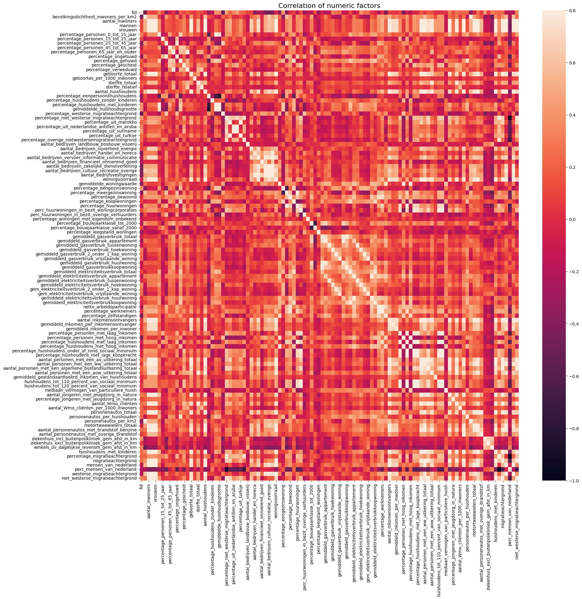

---

title: Correlation matrix

---

```python
import pandas as pd
import numpy as np
import matplotlib.pyplot as plt
import seaborn as sns

from IPython.display import Markdown as Markdown, display

data = pd.read_csv("wijkbuurtkaart_for_eda.csv")
```

# High correlated columns
Let's create a correlation matrix and get the pairs of features which would show strong correlation (so they value of their correlation would be > 0.7):


```python
numeric_data = data.select_dtypes(include=[np.number])
corr_matrix = numeric_data.corr()
f, ax = plt.subplots(figsize = (20,20))
plt.title('Correlation of numeric factors', y = 1, size = 16)
_ = sns.heatmap(corr_matrix, vmax = .8, annot = False)
```


    

    


It's impossible to see anything on this matrix, because dataset have a lot of features. So, let's print the strong correlated pairs of columns:


```python
def print_highly_correlated(df, features, threshold_down=0.7, threshold_up=1.0):
    """Prints highly correlated features pairs in the data frame (helpful for feature engineering)"""
    corr_df = df[features].corr()
    correlated_features = np.where((np.abs(corr_df) < threshold_up) & (np.abs(corr_df) > threshold_down)) # select ones above the abs threshold
    correlated_features = [(corr_df.iloc[x,y], x, y) for x, y in zip(*correlated_features) if x != y and x < y] # avoid duplication
    s_corr_list = sorted(correlated_features, key=lambda x: -abs(x[0])) # sort by correlation value
    if s_corr_list == []:
        print("There are no highly correlated features with correlation above", threshold_down)
    else:
        for v, i, j in s_corr_list:
            cols = df[features].columns
            print ("%s and %s = %.3f" % (corr_df.index[i], corr_df.columns[j], v))
```


```python
columns = [ column for column in numeric_data.columns if column not in ['aantal_inwoners', 'vrouwen', 'mannen', 'woningvoorraad'] ]
print_highly_correlated(numeric_data, columns)
```

    huishoudens_tot_110_percent_van_sociaal_minimum and huishoudens_tot_120_percent_van_sociaal_minimum = 0.996
    percentage_huishoudens_onder_of_rond_sociaal_minimum and huishoudens_tot_110_percent_van_sociaal_minimum = 0.991
    percentage_huishoudens_onder_of_rond_sociaal_minimum and huishoudens_tot_120_percent_van_sociaal_minimum = 0.981
    aantal_huishoudens and aantal_inkomensontvangers = 0.979
    personenautos_totaal and aantal_personenautos_met_brandstof_benzine = 0.976
    migratieachtergrond and niet_westerse_migratieachtergrond = 0.965
    percentage_huishoudens_met_lage_koopkracht and huishoudens_tot_110_percent_van_sociaal_minimum = 0.962
    percentage_huishoudens_onder_of_rond_sociaal_minimum and percentage_huishoudens_met_lage_koopkracht = 0.959
    aantal_bedrijven_zakelijke_dienstverlening and aantal_bedrijfsvestigingen = 0.952
    percentage_huishoudens_met_lage_koopkracht and huishoudens_tot_120_percent_van_sociaal_minimum = 0.951
    aantal_inkomensontvangers and aantal_personen_met_een_ww_uitkering_totaal = 0.945
    aantal_jongeren_met_jeugdzorg_in_natura and huishoudens_met_kinderen = 0.931
    aantal_huishoudens and aantal_personen_met_een_ww_uitkering_totaal = 0.925
    huishoudens_met_kinderen and migratieachtergrond = 0.907
    gemiddeld_gasverbruik_totaal and gemiddeld_gasverbruikkoopwoning = 0.907
    aantal_inkomensontvangers and huishoudens_met_kinderen = 0.902
    geboorte_totaal and aantal_inkomensontvangers = 0.900
    aantal_inkomensontvangers and migratieachtergrond = 0.892
    aantal_personen_met_een_ao_uitkering_totaal and migratieachtergrond = 0.891
    aantal_personen_met_een_ao_uitkering_totaal and aantal_Wmo_cliënten = 0.890
    aantal_huishoudens and westerse_migratieachtergrond = 0.889
    percentage_niet_westerse_migratieachtergrond and percentage_migratieachtergrond = 0.889
    percentage_niet_westerse_migratieachtergrond and perc_mensen_van_nederland = -0.889
    aantal_personenautos_met_brandstof_benzine and huishoudens_met_kinderen = 0.886
    percentage_huishoudens_met_kinderen and gemiddelde_huishoudsgrootte = 0.880
    gemiddeld_gasverbruik_appartement and gemiddeld_gasverbruik_huurwoning = 0.876
    aantal_inkomensontvangers and aantal_personenautos_met_brandstof_benzine = 0.874
    motortweewielers_totaal and mensen_van_nederland = 0.873
    mensen_van_nederland and westerse_migratieachtergrond = 0.870
    percentage_personen_0_tot_15_jaar and percentage_huishoudens_met_kinderen = 0.870
    geboorte_totaal and aantal_huishoudens = 0.870
    aantal_personen_met_een_algemene_bijstandsuitkering_totaal and niet_westerse_migratieachtergrond = 0.870
    bevolkingsdichtheid_inwoners_per_km2 and personenautos_per_km2 = 0.869
    aantal_personen_met_een_ao_uitkering_totaal and niet_westerse_migratieachtergrond = 0.869
    aantal_jongeren_met_jeugdzorg_in_natura and migratieachtergrond = 0.867
    aantal_personen_met_een_ao_uitkering_totaal and aantal_personen_met_een_algemene_bijstandsuitkering_totaal = 0.866
    aantal_personen_met_een_ao_uitkering_totaal and huishoudens_met_kinderen = 0.866
    aantal_inkomensontvangers and aantal_personen_met_een_ao_uitkering_totaal = 0.865
    personenautos_totaal and huishoudens_met_kinderen = 0.864
    geboorte_totaal and aantal_personen_met_een_ww_uitkering_totaal = 0.864
    aantal_jongeren_met_jeugdzorg_in_natura and niet_westerse_migratieachtergrond = 0.861
    aantal_inkomensontvangers and mensen_van_nederland = 0.861
    gemiddeld_gasverbruik_2_onder_1_kap_woning and gem_elektriciteitsverbruik_2_onder_1_kap_woning = 0.857
    huishoudens_met_kinderen and niet_westerse_migratieachtergrond = 0.857
    aantal_personen_met_een_aow_uitkering_totaal and aantal_Wmo_cliënten = 0.854
    geboorte_totaal and huishoudens_met_kinderen = 0.853
    aantal_huishoudens and migratieachtergrond = 0.853
    aantal_huishoudens and mensen_van_nederland = 0.853
    percentage_personen_65_jaar_en_ouder and percentage_verweduwd = 0.851
    aantal_personen_met_een_ww_uitkering_totaal and migratieachtergrond = 0.851
    aantal_personen_met_een_ww_uitkering_totaal and huishoudens_met_kinderen = 0.850
    percentage_personen_met_laag_inkomen and percentage_huishoudens_met_laag_inkomen = 0.850
    aantal_bedrijven_vervoer_informatie_communicatie and aantal_bedrijfsvestigingen = 0.850
    geboorte_totaal and migratieachtergrond = 0.849
    aantal_personen_met_een_algemene_bijstandsuitkering_totaal and migratieachtergrond = 0.845
    aantal_inkomensontvangers and personenautos_totaal = 0.844
    percentage_huishoudens_met_laag_inkomen and huishoudens_tot_120_percent_van_sociaal_minimum = 0.844
    aantal_inkomensontvangers and westerse_migratieachtergrond = 0.843
    netto_arbeidsparticipatie and percentage_werknemers = 0.841
    percentage_uit_nederlandse_antillen_en_aruba and percentage_uit_suriname = 0.839
    aantal_bedrijven_cultuur_recreatie_overige and aantal_bedrijfsvestigingen = 0.839
    aantal_personen_met_een_ao_uitkering_totaal and aantal_jongeren_met_jeugdzorg_in_natura = 0.839
    percentage_huishoudens_met_laag_inkomen and huishoudens_tot_110_percent_van_sociaal_minimum = 0.832
    aantal_personen_met_een_ao_uitkering_totaal and aantal_personen_met_een_ww_uitkering_totaal = 0.830
    aantal_personen_met_een_algemene_bijstandsuitkering_totaal and aantal_Wmo_cliënten = 0.817
    aantal_huishoudens and aantal_personen_met_een_ao_uitkering_totaal = 0.816
    percentage_eenpersoonshuishoudens and gemiddelde_huishoudsgrootte = -0.816
    gemiddeld_elektriciteitsverbruik_appartement and gemiddeld_elektriciteitsverbruik_huurwoning = 0.816
    percentage_huurwoningen and percentage_huishoudens_met_laag_inkomen = 0.816
    perc_huurwoningen_in_bezit_woningcorporaties and huishoudens_tot_120_percent_van_sociaal_minimum = 0.815
    aantal_bedrijven_zakelijke_dienstverlening and aantal_bedrijven_cultuur_recreatie_overige = 0.814
    percentage_huishoudens_met_laag_inkomen and percentage_huishoudens_onder_of_rond_sociaal_minimum = 0.814
    aantal_Wmo_cliënten and migratieachtergrond = 0.813
    aantal_huishoudens and huishoudens_met_kinderen = 0.812
    percentage_huishoudens_met_laag_inkomen and percentage_huishoudens_met_lage_koopkracht = 0.812
    percentage_personen_met_hoog_inkomen and percentage_huishoudens_met_hoog_inkomen = 0.812
    geboorte_totaal and aantal_personen_met_een_ao_uitkering_totaal = 0.808
    aantal_huishoudens and aantal_personenautos_met_brandstof_benzine = 0.808
    aantal_inkomensontvangers and motortweewielers_totaal = 0.807
    percentage_uit_marokko and percentage_uit_turkije = 0.806
    gemiddeld_gasverbruik_tussenwoning and gemiddeld_elektriciteitsverbruik_tussenwoning = 0.804
    perc_huurwoningen_in_bezit_woningcorporaties and huishoudens_tot_110_percent_van_sociaal_minimum = 0.803
    personenautos_totaal and aantal_personenautos_met_overige_brandstof = 0.801
    aantal_personen_met_een_ww_uitkering_totaal and aantal_personenautos_met_brandstof_benzine = 0.800
    aantal_personen_met_een_aow_uitkering_totaal and aantal_personenautos_met_brandstof_benzine = 0.798
    aantal_bedrijven_handel_en_horeca and aantal_bedrijfsvestigingen = 0.797
    aantal_personen_met_een_ww_uitkering_totaal and mensen_van_nederland = 0.793
    aantal_Wmo_cliënten and niet_westerse_migratieachtergrond = 0.792
    aantal_inkomensontvangers and aantal_jongeren_met_jeugdzorg_in_natura = 0.791
    percentage_meergezinswoning and percentage_huurwoningen = 0.790
    motortweewielers_totaal and aantal_personenautos_met_brandstof_benzine = 0.788
    aantal_inkomensontvangers and aantal_personen_met_een_aow_uitkering_totaal = 0.788
    aantal_personenautos_met_brandstof_benzine and mensen_van_nederland = 0.786
    percentage_personen_met_laag_inkomen and huishoudens_tot_120_percent_van_sociaal_minimum = 0.786
    aantal_inkomensontvangers and aantal_Wmo_cliënten = 0.784
    aantal_personenautos_met_brandstof_benzine and migratieachtergrond = 0.784
    sterfte_totaal and aantal_Wmo_cliënten = 0.784
    aantal_bedrijven_cultuur_recreatie_overige and westerse_migratieachtergrond = 0.783
    aantal_huishoudens and personenautos_totaal = 0.779
    geboorte_totaal and aantal_personenautos_met_brandstof_benzine = 0.779
    gemiddeld_gasverbruik_vrijstaande_woning and gem_elektriciteitsverbruik_vrijstaande_woning = 0.778
    aantal_bedrijven_vervoer_informatie_communicatie and aantal_bedrijven_zakelijke_dienstverlening = 0.777
    gemiddeld_gasverbruik_hoekwoning and gemiddeld_elektriciteitsverbruik_hoekwoning = 0.775
    geboorte_totaal and aantal_jongeren_met_jeugdzorg_in_natura = 0.775
    aantal_personen_met_een_algemene_bijstandsuitkering_totaal and aantal_jongeren_met_jeugdzorg_in_natura = 0.775
    personenautos_totaal and migratieachtergrond = 0.775
    sterfte_totaal and aantal_personen_met_een_aow_uitkering_totaal = 0.774
    aantal_personen_met_een_ww_uitkering_totaal and motortweewielers_totaal = 0.773
    perc_huurwoningen_in_bezit_woningcorporaties and percentage_huishoudens_onder_of_rond_sociaal_minimum = 0.771
    percentage_personen_25_tot_45_jaar and percentage_ongehuwd = 0.770
    aantal_huishoudens and aantal_personen_met_een_aow_uitkering_totaal = 0.770
    percentage_personen_met_laag_inkomen and huishoudens_tot_110_percent_van_sociaal_minimum = 0.770
    aantal_huishoudens and motortweewielers_totaal = 0.770
    aantal_personen_met_een_ww_uitkering_totaal and westerse_migratieachtergrond = 0.769
    aantal_jongeren_met_jeugdzorg_in_natura and aantal_personenautos_met_brandstof_benzine = 0.769
    aantal_inkomensontvangers and niet_westerse_migratieachtergrond = 0.768
    gemiddeld_gasverbruik_totaal and gemiddeld_gasverbruik_huurwoning = 0.766
    aantal_personen_met_een_ww_uitkering_totaal and personenautos_totaal = 0.766
    aantal_jongeren_met_jeugdzorg_in_natura and aantal_Wmo_cliënten = 0.765
    aantal_personen_met_een_ao_uitkering_totaal and aantal_personenautos_met_brandstof_benzine = 0.764
    personenautos_totaal and motortweewielers_totaal = 0.762
    gemiddelde_woningwaarde and percentage_huishoudens_met_hoog_inkomen = 0.762
    aantal_huishoudens and aantal_Wmo_cliënten = 0.761
    aantal_personen_met_een_ww_uitkering_totaal and aantal_jongeren_met_jeugdzorg_in_natura = 0.761
    aantal_Wmo_cliënten and huishoudens_met_kinderen = 0.759
    geboorte_totaal and personenautos_totaal = 0.759
    aantal_bedrijfsvestigingen and westerse_migratieachtergrond = 0.758
    gemiddeld_elektriciteitsverbruik_totaal and gemiddeld_elektriciteitsverbruikkoopwoning = 0.757
    aantal_bedrijven_zakelijke_dienstverlening and westerse_migratieachtergrond = 0.757
    geboorte_totaal and niet_westerse_migratieachtergrond = 0.754
    aantal_bedrijven_cultuur_recreatie_overige and mensen_van_nederland = 0.754
    percentage_personen_met_laag_inkomen and percentage_huishoudens_met_lage_koopkracht = 0.754
    percentage_niet_westerse_migratieachtergrond and niet_westerse_migratieachtergrond = 0.752
    aantal_jongeren_met_jeugdzorg_in_natura and personenautos_totaal = 0.751
    geboorte_totaal and mensen_van_nederland = 0.751
    personenautos_totaal and mensen_van_nederland = 0.747
    aantal_personen_met_een_aow_uitkering_totaal and personenautos_totaal = 0.747
    percentage_bewoond and percentage_werknemers = 0.746
    percentage_personen_met_laag_inkomen and percentage_huishoudens_onder_of_rond_sociaal_minimum = 0.746
    aantal_personen_met_een_ww_uitkering_totaal and niet_westerse_migratieachtergrond = 0.744
    gemiddelde_woningwaarde and percentage_personen_met_hoog_inkomen = 0.739
    percentage_personen_0_tot_15_jaar and gemiddelde_huishoudsgrootte = 0.738
    aantal_personen_met_een_ao_uitkering_totaal and personenautos_totaal = 0.735
    percentage_bewoond and netto_arbeidsparticipatie = 0.734
    geboorte_totaal and westerse_migratieachtergrond = 0.733
    aantal_personen_met_een_ao_uitkering_totaal and aantal_personen_met_een_aow_uitkering_totaal = 0.732
    aantal_inkomensontvangers and gemiddeld_inkomen_per_inwoner = 0.731
    motortweewielers_totaal and westerse_migratieachtergrond = 0.730
    aantal_inkomensontvangers and gemiddeld_inkomen_per_inkomensontvanger = 0.729
    aantal_huishoudens and aantal_bedrijven_vervoer_informatie_communicatie = 0.727
    aantal_inkomensontvangers and aantal_personen_met_een_algemene_bijstandsuitkering_totaal = 0.726
    percentage_overige_nietwestersemigratieachtergrond and percentage_migratieachtergrond = 0.726
    percentage_overige_nietwestersemigratieachtergrond and perc_mensen_van_nederland = -0.726
    aantal_personen_met_een_aow_uitkering_totaal and mensen_van_nederland = 0.725
    aantal_personen_met_een_algemene_bijstandsuitkering_totaal and huishoudens_met_kinderen = 0.725
    aantal_bedrijven_vervoer_informatie_communicatie and aantal_bedrijven_cultuur_recreatie_overige = 0.724
    aantal_bedrijven_vervoer_informatie_communicatie and westerse_migratieachtergrond = 0.724
    aantal_personen_met_een_ww_uitkering_totaal and aantal_Wmo_cliënten = 0.723
    aantal_bedrijven_vervoer_informatie_communicatie and aantal_inkomensontvangers = 0.721
    gemiddeld_gasverbruik_totaal and gemiddeld_gasverbruik_appartement = 0.721
    gemiddelde_woningwaarde and percentage_zelfstandigen = 0.720
    aantal_huishoudens and gemiddeld_inkomen_per_inwoner = 0.720
    perc_huurwoningen_in_bezit_woningcorporaties and percentage_huishoudens_met_lage_koopkracht = 0.717
    motortweewielers_totaal and huishoudens_met_kinderen = 0.717
    perc_huurwoningen_in_bezit_woningcorporaties and percentage_personen_met_laag_inkomen = 0.716
    gemiddeld_inkomen_per_inwoner and westerse_migratieachtergrond = 0.715
    aantal_huishoudens and gemiddeld_inkomen_per_inkomensontvanger = 0.714
    huishoudens_met_kinderen and mensen_van_nederland = 0.714
    percentage_huurwoningen and huishoudens_tot_120_percent_van_sociaal_minimum = 0.713
    aantal_personen_met_een_ww_uitkering_totaal and aantal_personen_met_een_algemene_bijstandsuitkering_totaal = 0.713
    percentage_bouwjaarklasse_tot_2000 and percentage_bouwjaarklasse_vanaf_2000 = -0.712
    percentage_werknemers and percentage_huishoudens_met_laag_inkomen = 0.711
    aantal_personen_met_een_algemene_bijstandsuitkering_totaal and huishoudens_tot_120_percent_van_sociaal_minimum = 0.711
    percentage_gehuwd and personenautos_per_huishouden = 0.709
    percentage_niet_westerse_migratieachtergrond and percentage_overige_nietwestersemigratieachtergrond = 0.709
    aantal_personenautos_met_brandstof_benzine and westerse_migratieachtergrond = 0.709
    aantal_Wmo_cliënten and aantal_personenautos_met_brandstof_benzine = 0.708
    percentage_niet_westerse_migratieachtergrond and percentage_uit_suriname = 0.708
    aantal_huishoudens and aantal_jongeren_met_jeugdzorg_in_natura = 0.708
    gemiddeld_inkomen_per_inwoner and mensen_van_nederland = 0.707
    aantal_huishoudens and aantal_bedrijven_cultuur_recreatie_overige = 0.707
    aantal_huishoudens and niet_westerse_migratieachtergrond = 0.706
    aantal_huishoudens and aantal_personen_met_een_algemene_bijstandsuitkering_totaal = 0.706
    percentage_koopwoningen and gemiddeld_elektriciteitsverbruik_totaal = 0.705
    geboorte_totaal and aantal_personen_met_een_algemene_bijstandsuitkering_totaal = 0.705
    aantal_personen_met_een_algemene_bijstandsuitkering_totaal and huishoudens_tot_110_percent_van_sociaal_minimum = 0.704
    percentage_huurwoningen and huishoudens_tot_110_percent_van_sociaal_minimum = 0.704
    netto_arbeidsparticipatie and percentage_zelfstandigen = 0.704
    percentage_uit_marokko and niet_westerse_migratieachtergrond = 0.702
    geboorte_totaal and motortweewielers_totaal = 0.701

