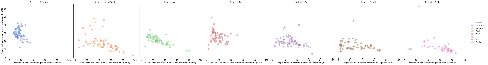

---

title:  Insights about Amsterdam residents.

---
* Collection, cleaning and preparing data for this analisys you can find [here](./collecting_data_for_eda.md)
* Correlation coefficients for the features from the insights you can find [here](./high_correlation.md)

Here, on this page, I would like to show you some insights I found in the data about amsterdammers. Let's go:

## Married couples with children in Amsterdam often also have a house and a car. 
### And mostly live outside a city centre close to other families with children.

    

    

## Residents who tend to use a lot of gas also use more electricity.

    

    

## Residents who earns more, tends to use electricity more.

    

    

## Self-employed residents earn more and live in the more expensive houses then employees.

    

    

    

    

## People with the same migration expirience choose to live in the same areas

### Moroccans and Turks also live close by in Amsterdam.
Most of them also live in Nieuw-West, usually with kids.

    

    

### People who moved from Surinam, Antillies and Arube live close to each other:
Also from the chart below you can see that most of them live in the Zuidoost district.

    

    

### There is quite big differentiation in where dutch people, people with western and non-western migration background live.

##### And it looks like native dutch people doesn't like to live next to the people with the non-western migration expirience. 

On the plots below we can see that in different Amsterdam districts we can meet different kind of people:

- Quite small amount of people with non-Western migration expirience (around **16.3%** of the neighbourhood population in average) live in the **Centrum** district.

- Same with **Zuid** district - only around **18.5%** of the neighbourhood population are non-Western people (in average).

- **West** is chosen more often by the people with non-Western migrantion background: in average **29.0%** of the neighbourhood population, compare to around **20.7%** of the people with the background from western countries. But most of the residents in the neighbourhoods (around **50.2%**) are still Dutch, with inverse proportion to non-Western people

- For the **Noord** and **Oost** districts we can see similar cases: relatively small amount of the people with western migration backgrounds (**14.2%** and **18.9%** of the neighbourhood population respectively) and the number of Dutch is also inversely proportional to the number of non-Western migrants. As many dutchmans live in the neighbourhood, as less people from Morocco you can meet there, according to the pictures below.

- **Nieuw West** looks more mixed: there is still inverse proportion relationship between Dutch and non-Western people, but they are much more evenly distributed among the area.

- Pictures of the **Zuidoost** district shows us that relatively small amount of Duchman of people from Western countries chooses this district to live in. Most often only **22.0%** and **11.0%** are Dutch and Western people, compare to **67.0%** of non-Western people in the neighbourhood population.

    

    

    

    

## People from non-Western countries often rent a houses from housing corporation, but people with Western migration background lke to rent from other kind of property owners.  

    

    

    

    

