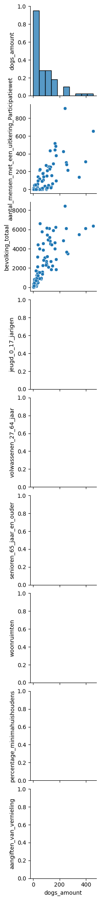

---

title:  Who owns the dog in Groningen?

---

I'm going to analyze the dataset of the Groningen dogs owners to see who are they - people who owns the dog in Groningen?

Let's take a look at the data I collect and prepared, so maybe there are any correlations and relationships between different factors.


```python
import pandas as pd
import numpy as np
import matplotlib.pyplot as plt
import seaborn as sns

data = pd.read_csv("population_clean_data.csv") 

print(data.columns)
data.head()
```

    Index(['buurtcode', 'buurtnaam', 'wijkcode',
           'bevolkingsdichtheid_inwoners_per_km2', 'aantal_inwoners', 'mannen',
           'vrouwen', 'percentage_personen_0_tot_15_jaar',
           'percentage_personen_15_tot_25_jaar',
           'percentage_personen_25_tot_45_jaar',
           'percentage_personen_45_tot_65_jaar',
           'percentage_personen_65_jaar_en_ouder', 'percentage_ongehuwd',
           'percentage_gehuwd', 'percentage_gescheid', 'percentage_verweduwd',
           'aantal_huishoudens', 'percentage_eenpersoonshuishoudens',
           'percentage_huishoudens_zonder_kinderen',
           'percentage_huishoudens_met_kinderen', 'gemiddelde_huishoudsgrootte',
           'percentage_westerse_migratieachtergrond',
           'percentage_niet_westerse_migratieachtergrond',
           'percentage_uit_marokko',
           'percentage_uit_nederlandse_antillen_en_aruba',
           'percentage_uit_suriname', 'percentage_uit_turkije',
           'percentage_overige_nietwestersemigratieachtergrond',
           'aantal_mensen_met_een_uitkering_Participatiewet',
           'percentage_mensen_met_een_uitkering_krachtens_de_Participatiewet',
           'bevolking_totaal', 'percentage_minimahuishoudens',
           'aantal_minimahuishoudens', 'gemiddeld_inkomen_per_persoon_met_inkomen',
           'gemiddeld_huishoudensinkomen', 'aangiften_diefstal_af_uit_woning',
           'aangiften_diefstal_auto', 'aangiften_diefstal_fiets',
           'aangiften_diefstal_af_uit_bedrijf', 'aangiften_diefstal_af_uit_auto',
           'aangiften_van_vernieling', 'aangiften_van_mishandeling', 'dogs_amount',
           'politie_report_aantal'],
          dtype='object')


<div>
<style scoped>
    .dataframe tbody tr th:only-of-type {
        vertical-align: middle;
    }

    .dataframe tbody tr th {
        vertical-align: top;
    }

    .dataframe thead th {
        text-align: right;
    }
</style>
<table border="1" class="dataframe">
  <thead>
    <tr style="text-align: right;">
      <th></th>
      <th>buurtcode</th>
      <th>buurtnaam</th>
      <th>wijkcode</th>
      <th>bevolkingsdichtheid_inwoners_per_km2</th>
      <th>aantal_inwoners</th>
      <th>mannen</th>
      <th>vrouwen</th>
      <th>percentage_personen_0_tot_15_jaar</th>
      <th>percentage_personen_15_tot_25_jaar</th>
      <th>percentage_personen_25_tot_45_jaar</th>
      <th>...</th>
      <th>gemiddeld_huishoudensinkomen</th>
      <th>aangiften_diefstal_af_uit_woning</th>
      <th>aangiften_diefstal_auto</th>
      <th>aangiften_diefstal_fiets</th>
      <th>aangiften_diefstal_af_uit_bedrijf</th>
      <th>aangiften_diefstal_af_uit_auto</th>
      <th>aangiften_van_vernieling</th>
      <th>aangiften_van_mishandeling</th>
      <th>dogs_amount</th>
      <th>politie_report_aantal</th>
    </tr>
  </thead>
  <tbody>
    <tr>
      <th>0</th>
      <td>BU000000</td>
      <td>Binnenstad-Noord</td>
      <td>WK001400</td>
      <td>12085</td>
      <td>4480</td>
      <td>2335</td>
      <td>2145</td>
      <td>2</td>
      <td>49</td>
      <td>33</td>
      <td>...</td>
      <td>30.0</td>
      <td>25.0</td>
      <td>1.0</td>
      <td>176.0</td>
      <td>17.0</td>
      <td>8.0</td>
      <td>25.0</td>
      <td>35.0</td>
      <td>37</td>
      <td>287.0</td>
    </tr>
    <tr>
      <th>1</th>
      <td>BU000103</td>
      <td>Rivierenbuurt</td>
      <td>WK001401</td>
      <td>8294</td>
      <td>4590</td>
      <td>2250</td>
      <td>2335</td>
      <td>5</td>
      <td>30</td>
      <td>37</td>
      <td>...</td>
      <td>31.0</td>
      <td>8.0</td>
      <td>0.0</td>
      <td>41.0</td>
      <td>0.0</td>
      <td>12.0</td>
      <td>13.0</td>
      <td>4.0</td>
      <td>76</td>
      <td>78.0</td>
    </tr>
    <tr>
      <th>2</th>
      <td>BU000704</td>
      <td>Piccardthof</td>
      <td>WK001407</td>
      <td>1332</td>
      <td>1190</td>
      <td>595</td>
      <td>590</td>
      <td>21</td>
      <td>14</td>
      <td>12</td>
      <td>...</td>
      <td>78.6</td>
      <td>4.0</td>
      <td>0.0</td>
      <td>3.0</td>
      <td>1.0</td>
      <td>0.0</td>
      <td>4.0</td>
      <td>2.0</td>
      <td>35</td>
      <td>14.0</td>
    </tr>
    <tr>
      <th>3</th>
      <td>BU001301</td>
      <td>Engelbert</td>
      <td>WK001413</td>
      <td>276</td>
      <td>900</td>
      <td>470</td>
      <td>435</td>
      <td>16</td>
      <td>12</td>
      <td>21</td>
      <td>...</td>
      <td>49.8</td>
      <td>1.0</td>
      <td>0.0</td>
      <td>0.0</td>
      <td>0.0</td>
      <td>0.0</td>
      <td>1.0</td>
      <td>2.0</td>
      <td>62</td>
      <td>4.0</td>
    </tr>
    <tr>
      <th>4</th>
      <td>BU000812</td>
      <td>De Kring</td>
      <td>WK001408</td>
      <td>3557</td>
      <td>330</td>
      <td>160</td>
      <td>170</td>
      <td>23</td>
      <td>12</td>
      <td>27</td>
      <td>...</td>
      <td>25.2</td>
      <td>1.0</td>
      <td>0.0</td>
      <td>0.0</td>
      <td>0.0</td>
      <td>0.0</td>
      <td>1.0</td>
      <td>0.0</td>
      <td>14</td>
      <td>2.0</td>
    </tr>
  </tbody>
</table>
<p>5 rows × 44 columns</p>
</div>


First I'm going to get `numeric` columns and see the correlation matrix (but )


```python
numeric_data = data.select_dtypes(include=[np.number])

corr_matrix = numeric_data.corr()
f, ax = plt.subplots(figsize = (14,12))
plt.title('Correlation of numeric factors', y = 1, size = 16)
dogs_amount = corr_matrix[['dogs_amount']]
sns.heatmap(corr_matrix, vmax = .8, annot_kws={'size': 7}, annot = True, square=True)
```


    <AxesSubplot: title={'center': 'Correlation of numeric factors'}>


    

    


```python
print(numeric_data.columns)
```

    Index(['bevolkingsdichtheid_inwoners_per_km2', 'aantal_inwoners', 'mannen',
           'vrouwen', 'percentage_personen_0_tot_15_jaar',
           'percentage_personen_15_tot_25_jaar',
           'percentage_personen_25_tot_45_jaar',
           'percentage_personen_45_tot_65_jaar',
           'percentage_personen_65_jaar_en_ouder', 'percentage_ongehuwd',
           'percentage_gehuwd', 'percentage_gescheid', 'percentage_verweduwd',
           'aantal_huishoudens', 'percentage_eenpersoonshuishoudens',
           'percentage_huishoudens_zonder_kinderen',
           'percentage_huishoudens_met_kinderen', 'gemiddelde_huishoudsgrootte',
           'percentage_westerse_migratieachtergrond',
           'percentage_niet_westerse_migratieachtergrond',
           'percentage_uit_marokko',
           'percentage_uit_nederlandse_antillen_en_aruba',
           'percentage_uit_suriname', 'percentage_uit_turkije',
           'percentage_overige_nietwestersemigratieachtergrond',
           'aantal_mensen_met_een_uitkering_Participatiewet',
           'percentage_mensen_met_een_uitkering_krachtens_de_Participatiewet',
           'bevolking_totaal', 'percentage_minimahuishoudens',
           'aantal_minimahuishoudens', 'gemiddeld_inkomen_per_persoon_met_inkomen',
           'gemiddeld_huishoudensinkomen', 'aangiften_diefstal_af_uit_woning',
           'aangiften_diefstal_auto', 'aangiften_diefstal_fiets',
           'aangiften_diefstal_af_uit_bedrijf', 'aangiften_diefstal_af_uit_auto',
           'aangiften_van_vernieling', 'aangiften_van_mishandeling', 'dogs_amount',
           'politie_report_aantal'],
          dtype='object')


```python
columns = ['dogs_amount',
           'aantal_mensen_met_een_uitkering_Participatiewet', 
           'bevolking_totaal',  
           'jeugd_0_17_jarigen', 
           'volwassenen_27_64_jaar', 
           'senioren_65_jaar_en_ouder',
           'woonruimten', 
           'percentage_minimahuishoudens', 
           'aangiften_van_vernieling']
sns.pairplot(data = data,
                  x_vars = ['dogs_amount'],
                  y_vars = columns)
```


    ---------------------------------------------------------------------------

    KeyError                                  Traceback (most recent call last)

    Cell In [4], line 10
          1 columns = ['dogs_amount',
          2            'aantal_mensen_met_een_uitkering_Participatiewet', 
          3            'bevolking_totaal',  
       (...)
          8            'percentage_minimahuishoudens', 
          9            'aangiften_van_vernieling']
    ---> 10 sns.pairplot(data = data,
         11                   x_vars = ['dogs_amount'],
         12                   y_vars = columns)


    File /Library/Frameworks/Python.framework/Versions/3.11/lib/python3.11/site-packages/seaborn/axisgrid.py:2158, in pairplot(data, hue, hue_order, palette, vars, x_vars, y_vars, kind, diag_kind, markers, height, aspect, corner, dropna, plot_kws, diag_kws, grid_kws, size)
       2156 if kind == "scatter":
       2157     from .relational import scatterplot  # Avoid circular import
    -> 2158     plotter(scatterplot, **plot_kws)
       2159 elif kind == "reg":
       2160     from .regression import regplot  # Avoid circular import


    File /Library/Frameworks/Python.framework/Versions/3.11/lib/python3.11/site-packages/seaborn/axisgrid.py:1428, in PairGrid.map_offdiag(self, func, **kwargs)
       1426             if x_var != y_var:
       1427                 indices.append((i, j))
    -> 1428     self._map_bivariate(func, indices, **kwargs)
       1429 return self


    File /Library/Frameworks/Python.framework/Versions/3.11/lib/python3.11/site-packages/seaborn/axisgrid.py:1568, in PairGrid._map_bivariate(self, func, indices, **kwargs)
       1566     if ax is None:  # i.e. we are in corner mode
       1567         continue
    -> 1568     self._plot_bivariate(x_var, y_var, ax, func, **kws)
       1569 self._add_axis_labels()
       1571 if "hue" in signature(func).parameters:


    File /Library/Frameworks/Python.framework/Versions/3.11/lib/python3.11/site-packages/seaborn/axisgrid.py:1594, in PairGrid._plot_bivariate(self, x_var, y_var, ax, func, **kwargs)
       1591 if self._hue_var is not None and self._hue_var not in axes_vars:
       1592     axes_vars.append(self._hue_var)
    -> 1594 data = self.data[axes_vars]
       1595 if self._dropna:
       1596     data = data.dropna()


    File /Library/Frameworks/Python.framework/Versions/3.11/lib/python3.11/site-packages/pandas/core/frame.py:3810, in DataFrame.__getitem__(self, key)
       3808     if is_iterator(key):
       3809         key = list(key)
    -> 3810     indexer = self.columns._get_indexer_strict(key, "columns")[1]
       3812 # take() does not accept boolean indexers
       3813 if getattr(indexer, "dtype", None) == bool:


    File /Library/Frameworks/Python.framework/Versions/3.11/lib/python3.11/site-packages/pandas/core/indexes/base.py:6111, in Index._get_indexer_strict(self, key, axis_name)
       6108 else:
       6109     keyarr, indexer, new_indexer = self._reindex_non_unique(keyarr)
    -> 6111 self._raise_if_missing(keyarr, indexer, axis_name)
       6113 keyarr = self.take(indexer)
       6114 if isinstance(key, Index):
       6115     # GH 42790 - Preserve name from an Index


    File /Library/Frameworks/Python.framework/Versions/3.11/lib/python3.11/site-packages/pandas/core/indexes/base.py:6174, in Index._raise_if_missing(self, key, indexer, axis_name)
       6171     raise KeyError(f"None of [{key}] are in the [{axis_name}]")
       6173 not_found = list(ensure_index(key)[missing_mask.nonzero()[0]].unique())
    -> 6174 raise KeyError(f"{not_found} not in index")


    KeyError: "['jeugd_0_17_jarigen'] not in index"


    

    

