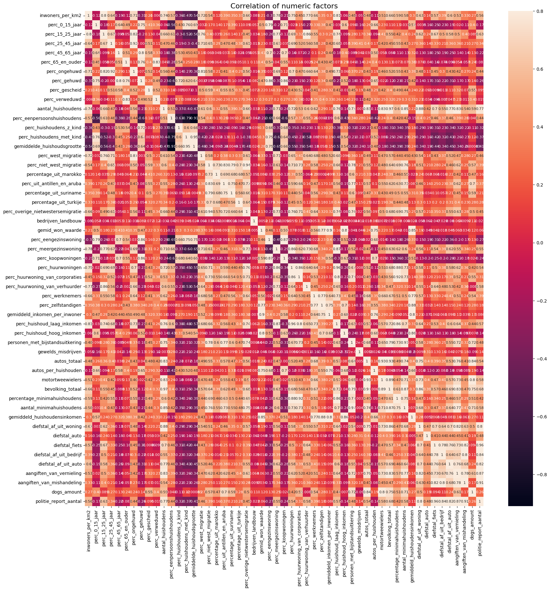

---

title:  Who owns a dog in Groningen?

---

I'm going to analyze the dataset of the Groningen dogs owners to see who are they - people who owns the dog in Groningen?

Let's take a look at the data I collect and prepared, so maybe there are any correlations and relationships between different factors.


```python
import pandas as pd
import numpy as np
import matplotlib.pyplot as plt
import seaborn as sns

data = pd.read_csv("population_clean_data.csv") 

print(data.columns)
data.head()
```

    Index(['buurtcode', 'buurtnaam', 'wijkcode', 'inwoners_per_km2',
           'perc_0_15_jaar', 'perc_15_25_jaar', 'perc_25_45_jaar',
           'perc_45_65_jaar', 'perc_65_en_ouder', 'perc_ongehuwd', 'perc_gehuwd',
           'perc_gescheid', 'perc_verweduwd', 'aantal_huishoudens',
           'perc_eenpersoonshuishoudens', 'perc_huishoudens_z_kind',
           'perc_huishoudens_met_kind', 'gemiddelde_huishoudsgrootte',
           'perc_west_migratie', 'perc_niet_west_migratie',
           'percentage_uit_marokko', 'perc_uit_antillen_en_aruba',
           'percentage_uit_suriname', 'percentage_uit_turkije',
           'perc_overige_nietwestersemigratie', 'bedrijven_landbouw',
           'gemid_won_waarde', 'perc_eengezinswoning', 'perc_meergezinswoning',
           'perc_koopwoningen', 'perc_huurwoningen',
           'perc_huurwoning_van_corporaties', 'perc_huurwoning_van_verhuurder',
           'perc_werknemers', 'perc_zelfstandigen',
           'gemiddeld_inkomen_per_inwoner', 'perc_huishoud_laag_inkomen',
           'perc_huishoud_hoog_inkomen', 'personen_met_bijstandsuitkering',
           'gewelds_misdrijven', 'autos_totaal', 'autos_per_huishouden',
           'motortweewielers', 'bevolking_totaal', 'percentage_minimahuishoudens',
           'aantal_minimahuishoudens', 'gemiddeld_huishoudensinkomen',
           'diefstal_af_uit_woning', 'diefstal_auto', 'diefstal_fiets',
           'diefstal_af_uit_bedrijf', 'diefstal_af_uit_auto',
           'aangiften_van_vernieling', 'aangiften_van_mishandeling', 'dogs_amount',
           'politie_report_aantal'],
          dtype='object')


<div>
<style scoped>
    .dataframe tbody tr th:only-of-type {
        vertical-align: middle;
    }

    .dataframe tbody tr th {
        vertical-align: top;
    }

    .dataframe thead th {
        text-align: right;
    }
</style>
<table border="1" class="dataframe">
  <thead>
    <tr style="text-align: right;">
      <th></th>
      <th>buurtcode</th>
      <th>buurtnaam</th>
      <th>wijkcode</th>
      <th>inwoners_per_km2</th>
      <th>perc_0_15_jaar</th>
      <th>perc_15_25_jaar</th>
      <th>perc_25_45_jaar</th>
      <th>perc_45_65_jaar</th>
      <th>perc_65_en_ouder</th>
      <th>perc_ongehuwd</th>
      <th>...</th>
      <th>gemiddeld_huishoudensinkomen</th>
      <th>diefstal_af_uit_woning</th>
      <th>diefstal_auto</th>
      <th>diefstal_fiets</th>
      <th>diefstal_af_uit_bedrijf</th>
      <th>diefstal_af_uit_auto</th>
      <th>aangiften_van_vernieling</th>
      <th>aangiften_van_mishandeling</th>
      <th>dogs_amount</th>
      <th>politie_report_aantal</th>
    </tr>
  </thead>
  <tbody>
    <tr>
      <th>0</th>
      <td>BU000000</td>
      <td>Binnenstad-Noord</td>
      <td>WK001400</td>
      <td>11891.0</td>
      <td>2.0</td>
      <td>46.0</td>
      <td>35.0</td>
      <td>11.0</td>
      <td>6.0</td>
      <td>86.0</td>
      <td>...</td>
      <td>30.0</td>
      <td>25.0</td>
      <td>1.0</td>
      <td>176.0</td>
      <td>17.0</td>
      <td>8.0</td>
      <td>25.0</td>
      <td>35.0</td>
      <td>37</td>
      <td>287.0</td>
    </tr>
    <tr>
      <th>1</th>
      <td>BU000001</td>
      <td>Binnenstad-Zuid</td>
      <td>WK001400</td>
      <td>12011.0</td>
      <td>2.0</td>
      <td>47.0</td>
      <td>33.0</td>
      <td>11.0</td>
      <td>6.0</td>
      <td>87.0</td>
      <td>...</td>
      <td>30.7</td>
      <td>42.0</td>
      <td>3.0</td>
      <td>306.0</td>
      <td>28.0</td>
      <td>30.0</td>
      <td>96.0</td>
      <td>196.0</td>
      <td>51</td>
      <td>701.0</td>
    </tr>
    <tr>
      <th>2</th>
      <td>BU000002</td>
      <td>Binnenstad-Oost</td>
      <td>WK001400</td>
      <td>14979.0</td>
      <td>3.0</td>
      <td>40.0</td>
      <td>36.0</td>
      <td>14.0</td>
      <td>7.0</td>
      <td>84.0</td>
      <td>...</td>
      <td>27.8</td>
      <td>17.0</td>
      <td>1.0</td>
      <td>56.0</td>
      <td>2.0</td>
      <td>3.0</td>
      <td>16.0</td>
      <td>8.0</td>
      <td>48</td>
      <td>103.0</td>
    </tr>
    <tr>
      <th>3</th>
      <td>BU000003</td>
      <td>Binnenstad-West</td>
      <td>WK001400</td>
      <td>17507.0</td>
      <td>2.0</td>
      <td>38.0</td>
      <td>40.0</td>
      <td>11.0</td>
      <td>9.0</td>
      <td>84.0</td>
      <td>...</td>
      <td>29.7</td>
      <td>9.0</td>
      <td>0.0</td>
      <td>13.0</td>
      <td>2.0</td>
      <td>4.0</td>
      <td>8.0</td>
      <td>5.0</td>
      <td>21</td>
      <td>41.0</td>
    </tr>
    <tr>
      <th>4</th>
      <td>BU000005</td>
      <td>Hortusbuurt-Ebbingekwartier</td>
      <td>WK001400</td>
      <td>12509.0</td>
      <td>5.0</td>
      <td>41.0</td>
      <td>30.0</td>
      <td>15.0</td>
      <td>9.0</td>
      <td>82.0</td>
      <td>...</td>
      <td>32.1</td>
      <td>20.0</td>
      <td>2.0</td>
      <td>68.0</td>
      <td>16.0</td>
      <td>9.0</td>
      <td>24.0</td>
      <td>13.0</td>
      <td>108</td>
      <td>152.0</td>
    </tr>
  </tbody>
</table>
<p>5 rows × 56 columns</p>
</div>


First I'm going to get `numeric` columns and see the correlation matrix (but )


```python
numeric_data = data.select_dtypes(include=[np.number])

corr_matrix = numeric_data.corr()
f, ax = plt.subplots(figsize = (20,20))
plt.title('Correlation of numeric factors', y = 1, size = 16)
sns.heatmap(corr_matrix, vmax = .8, annot_kws={'size': 8}, annot = True)
```


    <AxesSubplot: title={'center': 'Correlation of numeric factors'}>


    

    


Looking at the picture of the correlation matrix (above) I can say that there are definately some correlations there, but because there are a lot of factors and poor readability of the matrix, it's difficult to say anything spetial, so let's take a closer look. We are interested in the dog's owners, so I will take a `dogs_amount` column and show it's correlation with other factors:


```python
dogs_amount = corr_matrix[['dogs_amount']]
fig, ax = plt.subplots(figsize=(16, 16))
ax = sns.heatmap(dogs_amount, vmax = .8, annot_kws={'size': 10}, annot = True, linewidths=.5)
```


    

    


Now let's get only strong correlated columns:


```python
corr_values = [row for row in dogs_amount.items()][0][1]
columns = [column for column in numeric_data.columns if corr_values[column] > 0.6]
```


```python
sns.pairplot(data = data,
             x_vars = ['dogs_amount'],
             y_vars = columns)
```


    <seaborn.axisgrid.PairGrid at 0x13fbb8f90>


    

    


```python
for column in columns:
    print(column + ": " + str(corr_values[column]))
```

    perc_uit_antillen_en_aruba: 0.7000535645951397
    personen_met_bijstandsuitkering: 0.722981338084339
    autos_totaal: 0.8369100868143818
    motortweewielers: 0.796743835950187
    bevolking_totaal: 0.7475149616129847
    aantal_minimahuishoudens: 0.709500199839632
    aangiften_van_vernieling: 0.6056959022366318
    dogs_amount: 1.0


As an answer to the question: "Who owns a dog in Groningen?"  we can see from the charts above, most of the dog's owners in Groningen have a car or two wheelers motorcycle, receive some welfare benefits and probably live in the area where they would experience destruction from other people more than in other places. Also I can see that probably people, who moved to the Netherlands from Netherlands Antilles and Aruba love dogs and have it at home more often them other people.
