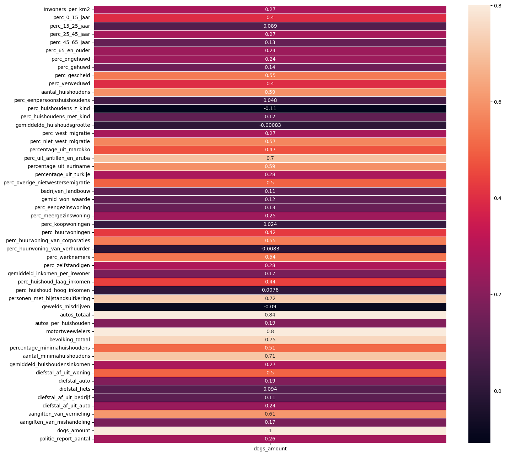

---

title:  Who owns the dog in Groningen?

---

I'm going to analyze the dataset of the Groningen dogs owners to see who are they - people who owns the dog in Groningen?

Let's take a look at the data I collect and prepared, so maybe there are any correlations and relationships between different factors.


```python
import pandas as pd
import numpy as np
import matplotlib.pyplot as plt
import seaborn as sns

data = pd.read_csv("population_clean_data.csv") 

print(data.columns)
data.head()
```

    Index(['buurtcode', 'buurtnaam', 'wijkcode', 'inwoners_per_km2',
           'aantal_inwoners', 'mannen', 'vrouwen', 'perc_0_15_jaar',
           'perc_15_25_jaar', 'perc_25_45_jaar', 'perc_45_65_jaar',
           'perc_65_en_ouder', 'perc_ongehuwd', 'perc_gehuwd', 'perc_gescheid',
           'perc_verweduwd', 'aantal_huishoudens', 'perc_eenpersoonshuishoudens',
           'perc_huishoudens_z_kind', 'perc_huishoudens_met_kind',
           'gemiddelde_huishoudsgrootte', 'perc_west_migratie',
           'perc_niet_west_migratie', 'percentage_uit_marokko',
           'perc_uit_antillen_en_aruba', 'percentage_uit_suriname',
           'percentage_uit_turkije', 'perc_overige_nietwestersemigratie',
           'aantal_mensen_met_pw', 'perc_mensen_met_pw', 'bevolking_totaal',
           'percentage_minimahuishoudens', 'aantal_minimahuishoudens',
           'gemiddeld_inkomen_per_p_met_inkomen', 'gemiddeld_huishoudensinkomen',
           'diefstal_af_uit_woning', 'diefstal_auto', 'diefstal_fiets',
           'diefstal_af_uit_bedrijf', 'diefstal_af_uit_auto',
           'aangiften_van_vernieling', 'aangiften_van_mishandeling', 'dogs_amount',
           'politie_report_aantal'],
          dtype='object')


<div>
<style scoped>
    .dataframe tbody tr th:only-of-type {
        vertical-align: middle;
    }

    .dataframe tbody tr th {
        vertical-align: top;
    }

    .dataframe thead th {
        text-align: right;
    }
</style>
<table border="1" class="dataframe">
  <thead>
    <tr style="text-align: right;">
      <th></th>
      <th>buurtcode</th>
      <th>buurtnaam</th>
      <th>wijkcode</th>
      <th>inwoners_per_km2</th>
      <th>aantal_inwoners</th>
      <th>mannen</th>
      <th>vrouwen</th>
      <th>perc_0_15_jaar</th>
      <th>perc_15_25_jaar</th>
      <th>perc_25_45_jaar</th>
      <th>...</th>
      <th>gemiddeld_huishoudensinkomen</th>
      <th>diefstal_af_uit_woning</th>
      <th>diefstal_auto</th>
      <th>diefstal_fiets</th>
      <th>diefstal_af_uit_bedrijf</th>
      <th>diefstal_af_uit_auto</th>
      <th>aangiften_van_vernieling</th>
      <th>aangiften_van_mishandeling</th>
      <th>dogs_amount</th>
      <th>politie_report_aantal</th>
    </tr>
  </thead>
  <tbody>
    <tr>
      <th>0</th>
      <td>BU000000</td>
      <td>Binnenstad-Noord</td>
      <td>WK001400</td>
      <td>12085</td>
      <td>4480</td>
      <td>2335</td>
      <td>2145</td>
      <td>2</td>
      <td>49</td>
      <td>33</td>
      <td>...</td>
      <td>30.0</td>
      <td>25.0</td>
      <td>1.0</td>
      <td>176.0</td>
      <td>17.0</td>
      <td>8.0</td>
      <td>25.0</td>
      <td>35.0</td>
      <td>37</td>
      <td>287.0</td>
    </tr>
    <tr>
      <th>1</th>
      <td>BU000103</td>
      <td>Rivierenbuurt</td>
      <td>WK001401</td>
      <td>8294</td>
      <td>4590</td>
      <td>2250</td>
      <td>2335</td>
      <td>5</td>
      <td>30</td>
      <td>37</td>
      <td>...</td>
      <td>31.0</td>
      <td>8.0</td>
      <td>0.0</td>
      <td>41.0</td>
      <td>0.0</td>
      <td>12.0</td>
      <td>13.0</td>
      <td>4.0</td>
      <td>76</td>
      <td>78.0</td>
    </tr>
    <tr>
      <th>2</th>
      <td>BU000704</td>
      <td>Piccardthof</td>
      <td>WK001407</td>
      <td>1332</td>
      <td>1190</td>
      <td>595</td>
      <td>590</td>
      <td>21</td>
      <td>14</td>
      <td>12</td>
      <td>...</td>
      <td>78.6</td>
      <td>4.0</td>
      <td>0.0</td>
      <td>3.0</td>
      <td>1.0</td>
      <td>0.0</td>
      <td>4.0</td>
      <td>2.0</td>
      <td>35</td>
      <td>14.0</td>
    </tr>
    <tr>
      <th>3</th>
      <td>BU001301</td>
      <td>Engelbert</td>
      <td>WK001413</td>
      <td>276</td>
      <td>900</td>
      <td>470</td>
      <td>435</td>
      <td>16</td>
      <td>12</td>
      <td>21</td>
      <td>...</td>
      <td>49.8</td>
      <td>1.0</td>
      <td>0.0</td>
      <td>0.0</td>
      <td>0.0</td>
      <td>0.0</td>
      <td>1.0</td>
      <td>2.0</td>
      <td>62</td>
      <td>4.0</td>
    </tr>
    <tr>
      <th>4</th>
      <td>BU000812</td>
      <td>De Kring</td>
      <td>WK001408</td>
      <td>3557</td>
      <td>330</td>
      <td>160</td>
      <td>170</td>
      <td>23</td>
      <td>12</td>
      <td>27</td>
      <td>...</td>
      <td>25.2</td>
      <td>1.0</td>
      <td>0.0</td>
      <td>0.0</td>
      <td>0.0</td>
      <td>0.0</td>
      <td>1.0</td>
      <td>0.0</td>
      <td>14</td>
      <td>2.0</td>
    </tr>
  </tbody>
</table>
<p>5 rows × 44 columns</p>
</div>


First I'm going to get `numeric` columns and see the correlation matrix (but )


```python
numeric_data = data.select_dtypes(include=[np.number])

corr_matrix = numeric_data.corr()
f, ax = plt.subplots(figsize = (14,12))
plt.title('Correlation of numeric factors', y = 1, size = 16)
sns.heatmap(corr_matrix, vmax = .8, annot_kws={'size': 8}, annot = True)
```


    <AxesSubplot: title={'center': 'Correlation of numeric factors'}>


    

    


Looking at the picture of the correlation matrix (above) I can say that there are definately some correlations there, but because there are a lot of factor, I can't see anything. But we are interested in the dog's owners, so let's take a look at correlations with `dogs_amount` column of the correlation matrix


```python
dogs_amount = corr_matrix[['dogs_amount']]
fig, ax = plt.subplots(figsize=(16, 16))
ax = sns.heatmap(dogs_amount, vmax = .8, annot_kws={'size': 10}, annot = True, linewidths=.5)
```


    

    


Let's get from correlation matrix only high correlated columns. 


```python
cor_matrix = corr_matrix.abs()
upper_tri = cor_matrix.where(np.triu(np.ones(cor_matrix.shape),k=1).astype(np.bool))
columns = [column for column in upper_tri.columns if any(upper_tri[column] > 0.5)]
       
print(columns)
```

    ['aantal_inwoners', 'mannen', 'vrouwen', 'perc_15_25_jaar', 'perc_25_45_jaar', 'perc_45_65_jaar', 'perc_65_en_ouder', 'perc_ongehuwd', 'perc_gehuwd', 'perc_gescheid', 'perc_verweduwd', 'aantal_huishoudens', 'perc_eenpersoonshuishoudens', 'perc_huishoudens_z_kind', 'perc_huishoudens_met_kind', 'gemiddelde_huishoudsgrootte', 'perc_west_migratie', 'perc_niet_west_migratie', 'percentage_uit_marokko', 'perc_uit_antillen_en_aruba', 'percentage_uit_suriname', 'percentage_uit_turkije', 'perc_overige_nietwestersemigratie', 'aantal_mensen_met_pw', 'perc_mensen_met_pw', 'bevolking_totaal', 'percentage_minimahuishoudens', 'aantal_minimahuishoudens', 'gemiddeld_inkomen_per_p_met_inkomen', 'gemiddeld_huishoudensinkomen', 'diefstal_af_uit_woning', 'diefstal_fiets', 'diefstal_af_uit_bedrijf', 'diefstal_af_uit_auto', 'aangiften_van_vernieling', 'aangiften_van_mishandeling', 'dogs_amount', 'politie_report_aantal']


    /var/folders/1q/nw56sv790t34hlk8f_j1dtxh0000gn/T/ipykernel_53074/164323969.py:2: DeprecationWarning: `np.bool` is a deprecated alias for the builtin `bool`. To silence this warning, use `bool` by itself. Doing this will not modify any behavior and is safe. If you specifically wanted the numpy scalar type, use `np.bool_` here.
    Deprecated in NumPy 1.20; for more details and guidance: https://numpy.org/devdocs/release/1.20.0-notes.html#deprecations
      upper_tri = cor_matrix.where(np.triu(np.ones(cor_matrix.shape),k=1).astype(np.bool))


```python
sns.pairplot(data = data,
                  x_vars = ['dogs_amount'],
                  y_vars = columns)
```


    <seaborn.axisgrid.PairGrid at 0x14527a550>


    

    

