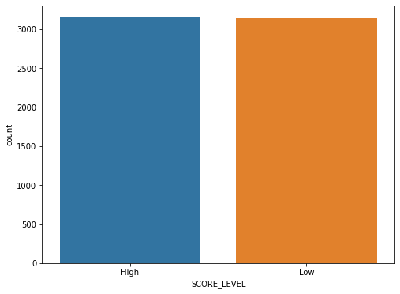
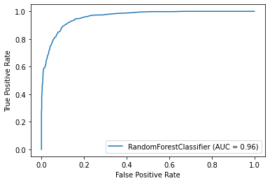
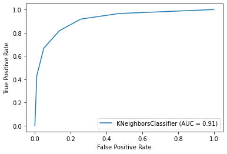
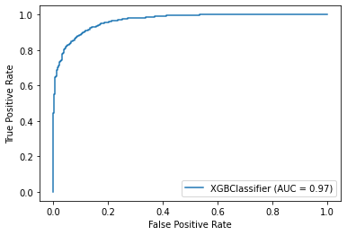
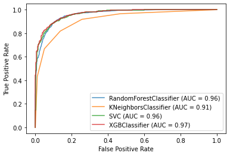
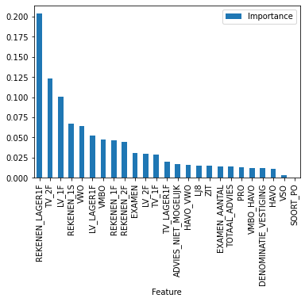

# Dutch primary school CET score
 
## Overview

In The Netherlands children start going to school when they turn 4. So now I need to choose the best school for my toddler. I think it should meet a large number of charactheristic. It should be able to give my child a worthy knowlegde, so that he gets a good score in the final exam to continue his education in a good secondary school.

I found that Dutch Ministry of education, culture and science has opened some of their data. I collected the data from https://duo.nl/open_onderwijsdata/databestanden/ into a dataset and now I want to analyse what I have there. Ideally I would also want to find if it is possible to calcuate the quality of the education which school can give to students based on the data we have or if we need some extra data to define this.

One of the main factors that could define a quality of education is the final exams score. I will analyse it first.

First of all I want to know what does CET score depend on and how it is defined by other factors. To solve this problem I'm going to read the dataset from the file Score.csv and get data from the latest year we have(2018). I will clean it, will make a new feature which would mean the level of the average CET score for each school.

As a result I will try to build a classifier for those CET score levels to be able to predict how "good" the exam result will be depending on other parameters we have. To do that I will use a number of classification algorithms and pick the best one.

## Data preparation

Let's start with reading the dataset from the file 'Score.csv'. We'll read data for only one year (for example, the year of 2018):


```python
import pandas as pd 
import matplotlib.pyplot as plt
import seaborn as sns
import numpy as np

data_score = pd.read_csv("./make_school_data/main/output/Score.csv", error_bad_lines=False, sep=',', encoding = "ISO-8859-1") 
data_score = data_score[data_score['DATUM'] == 2018]
print(data_score.shape)
print(data_score.columns)
data_score.head()
```

    (6286, 33)
    Index(['SCHOOL_ID', 'DATUM', 'INSTELLINGSNAAM_VESTIGING', 'POSTCODE_VESTIGING',
           'PLAATSNAAM', 'GEMEENTENAAM', 'PROVINCIE', 'SOORT_PO',
           'DENOMINATIE_VESTIGING', 'EXAMEN', 'EXAMEN_AANTAL', 'EXAMEN_GEM',
           'REKENEN_LAGER1F', 'REKENEN_1F', 'REKENEN_1S', 'REKENEN_2F',
           'LV_LAGER1F', 'LV_1F', 'LV_2F', 'TV_LAGER1F', 'TV_1F', 'TV_2F', 'VSO',
           'PRO', 'VMBO', 'VMBO_HAVO', 'HAVO', 'HAVO_VWO', 'VWO',
           'ADVIES_NIET_MOGELIJK', 'TOTAAL_ADVIES', 'LJ8', 'ZIT'],
          dtype='object')


<div>
<style scoped>
    .dataframe tbody tr th:only-of-type {
        vertical-align: middle;
    }

    .dataframe tbody tr th {
        vertical-align: top;
    }

    .dataframe thead th {
        text-align: right;
    }
</style>
<table border="1" class="dataframe">
  <thead>
    <tr style="text-align: right;">
      <th></th>
      <th>SCHOOL_ID</th>
      <th>DATUM</th>
      <th>INSTELLINGSNAAM_VESTIGING</th>
      <th>POSTCODE_VESTIGING</th>
      <th>PLAATSNAAM</th>
      <th>GEMEENTENAAM</th>
      <th>PROVINCIE</th>
      <th>SOORT_PO</th>
      <th>DENOMINATIE_VESTIGING</th>
      <th>EXAMEN</th>
      <th>...</th>
      <th>PRO</th>
      <th>VMBO</th>
      <th>VMBO_HAVO</th>
      <th>HAVO</th>
      <th>HAVO_VWO</th>
      <th>VWO</th>
      <th>ADVIES_NIET_MOGELIJK</th>
      <th>TOTAAL_ADVIES</th>
      <th>LJ8</th>
      <th>ZIT</th>
    </tr>
  </thead>
  <tbody>
    <tr>
      <th>18739</th>
      <td>000AP_2018</td>
      <td>2018</td>
      <td>De Schanskorf</td>
      <td>2715BT</td>
      <td>ZOETERMEER</td>
      <td>Zoetermeer</td>
      <td>Zuid-Holland</td>
      <td>Bo</td>
      <td>Gereformeerd vrijgemaakt</td>
      <td>CET</td>
      <td>...</td>
      <td>0</td>
      <td>0</td>
      <td>2</td>
      <td>4</td>
      <td>0</td>
      <td>3</td>
      <td>0</td>
      <td>11</td>
      <td>11</td>
      <td>1</td>
    </tr>
    <tr>
      <th>18740</th>
      <td>000AR_2018</td>
      <td>2018</td>
      <td>BS "De Maasparel"</td>
      <td>6107AW</td>
      <td>STEVENSWEERT</td>
      <td>Maasgouw</td>
      <td>Limburg</td>
      <td>Bo</td>
      <td>Rooms-Katholiek</td>
      <td>CET</td>
      <td>...</td>
      <td>0</td>
      <td>1</td>
      <td>0</td>
      <td>4</td>
      <td>0</td>
      <td>9</td>
      <td>0</td>
      <td>17</td>
      <td>17</td>
      <td>1</td>
    </tr>
    <tr>
      <th>18741</th>
      <td>000AV_2018</td>
      <td>2018</td>
      <td>De Morgenster</td>
      <td>3201CN</td>
      <td>SPIJKENISSE</td>
      <td>Nissewaard</td>
      <td>Zuid-Holland</td>
      <td>Bo</td>
      <td>Gereformeerd vrijgemaakt</td>
      <td>CET</td>
      <td>...</td>
      <td>0</td>
      <td>0</td>
      <td>3</td>
      <td>1</td>
      <td>3</td>
      <td>2</td>
      <td>0</td>
      <td>12</td>
      <td>12</td>
      <td>1</td>
    </tr>
    <tr>
      <th>18742</th>
      <td>000AZ_2018</td>
      <td>2018</td>
      <td>De Stapsteen</td>
      <td>2971AR</td>
      <td>BLESKENSGRAAF CA</td>
      <td>Molenwaard</td>
      <td>Zuid-Holland</td>
      <td>Bo</td>
      <td>Openbaar</td>
      <td>IEP</td>
      <td>...</td>
      <td>2</td>
      <td>1</td>
      <td>5</td>
      <td>3</td>
      <td>0</td>
      <td>3</td>
      <td>0</td>
      <td>15</td>
      <td>14</td>
      <td>2</td>
    </tr>
    <tr>
      <th>18743</th>
      <td>000BB_2018</td>
      <td>2018</td>
      <td>Obs Letterwies</td>
      <td>9944AR</td>
      <td>NIEUWOLDA</td>
      <td>Oldambt</td>
      <td>Groningen</td>
      <td>Bo</td>
      <td>Openbaar</td>
      <td>CET</td>
      <td>...</td>
      <td>0</td>
      <td>5</td>
      <td>2</td>
      <td>4</td>
      <td>1</td>
      <td>2</td>
      <td>0</td>
      <td>21</td>
      <td>11</td>
      <td>1</td>
    </tr>
  </tbody>
</table>
<p>5 rows × 33 columns</p>
</div>


I want to create a new variable which would mean how well students of a particular school take the exam. We have a few exams chosen by schools, let's take a look at them:


```python
data_score['EXAMEN'].value_counts()
```


    CET       3527
    IEP       1790
    ROUTE8     833
    DIA         83
    AMN         53
    Name: EXAMEN, dtype: int64


I will create a new variable called **SCORE_TYPE** with values 'low' and 'high' depending on the score and on the chosen exam, because the average score is different for different exams:


```python
def get_type_score(row): 
    result = "Low"
    exam_data = data_score[data_score['EXAMEN'] == row.EXAMEN]
    if(row.EXAMEN_GEM < exam_data['EXAMEN_GEM'].median()):
        result = "Low"
    else:
        result = "High"
    return result

data_score['SCORE_LEVEL'] =  data_score.apply(lambda row: get_type_score(row), axis = 1)
```


```python
print(data_score['SCORE_LEVEL'].value_counts())
```

    High    3146
    Low     3140
    Name: SCORE_LEVEL, dtype: int64


Next I want to remove unnecessary columns because some of them are higly correlated (like a few columns which describe an address of a school, we can leave only one of them) and some of them – we just don't need (like **SCHOOL_ID** or **BEVOEGD_GEZAG_NUMMER**), or they mean the same thing as outcome (like the score variable **EXAMEN_GEM**):


```python
columns = ['EXAMEN_GEM', 'SCHOOL_ID', 'DATUM', 'INSTELLINGSNAAM_VESTIGING', 'POSTCODE_VESTIGING', 
           'PLAATSNAAM', 'GEMEENTENAAM', 'PROVINCIE']
print(data_score.shape)
data = data_score.drop(columns, 1)
print(data.shape)
print(data.columns)
data.head()
```

    (6286, 34)
    (6286, 26)
    Index(['SOORT_PO', 'DENOMINATIE_VESTIGING', 'EXAMEN', 'EXAMEN_AANTAL',
           'REKENEN_LAGER1F', 'REKENEN_1F', 'REKENEN_1S', 'REKENEN_2F',
           'LV_LAGER1F', 'LV_1F', 'LV_2F', 'TV_LAGER1F', 'TV_1F', 'TV_2F', 'VSO',
           'PRO', 'VMBO', 'VMBO_HAVO', 'HAVO', 'HAVO_VWO', 'VWO',
           'ADVIES_NIET_MOGELIJK', 'TOTAAL_ADVIES', 'LJ8', 'ZIT', 'SCORE_LEVEL'],
          dtype='object')


<div>
<style scoped>
    .dataframe tbody tr th:only-of-type {
        vertical-align: middle;
    }

    .dataframe tbody tr th {
        vertical-align: top;
    }

    .dataframe thead th {
        text-align: right;
    }
</style>
<table border="1" class="dataframe">
  <thead>
    <tr style="text-align: right;">
      <th></th>
      <th>SOORT_PO</th>
      <th>DENOMINATIE_VESTIGING</th>
      <th>EXAMEN</th>
      <th>EXAMEN_AANTAL</th>
      <th>REKENEN_LAGER1F</th>
      <th>REKENEN_1F</th>
      <th>REKENEN_1S</th>
      <th>REKENEN_2F</th>
      <th>LV_LAGER1F</th>
      <th>LV_1F</th>
      <th>...</th>
      <th>VMBO</th>
      <th>VMBO_HAVO</th>
      <th>HAVO</th>
      <th>HAVO_VWO</th>
      <th>VWO</th>
      <th>ADVIES_NIET_MOGELIJK</th>
      <th>TOTAAL_ADVIES</th>
      <th>LJ8</th>
      <th>ZIT</th>
      <th>SCORE_LEVEL</th>
    </tr>
  </thead>
  <tbody>
    <tr>
      <th>18739</th>
      <td>Bo</td>
      <td>Gereformeerd vrijgemaakt</td>
      <td>CET</td>
      <td>11</td>
      <td>1</td>
      <td>5</td>
      <td>5</td>
      <td>0</td>
      <td>0</td>
      <td>1</td>
      <td>...</td>
      <td>0</td>
      <td>2</td>
      <td>4</td>
      <td>0</td>
      <td>3</td>
      <td>0</td>
      <td>11</td>
      <td>11</td>
      <td>1</td>
      <td>High</td>
    </tr>
    <tr>
      <th>18740</th>
      <td>Bo</td>
      <td>Rooms-Katholiek</td>
      <td>CET</td>
      <td>17</td>
      <td>0</td>
      <td>5</td>
      <td>12</td>
      <td>0</td>
      <td>1</td>
      <td>1</td>
      <td>...</td>
      <td>1</td>
      <td>0</td>
      <td>4</td>
      <td>0</td>
      <td>9</td>
      <td>0</td>
      <td>17</td>
      <td>17</td>
      <td>1</td>
      <td>High</td>
    </tr>
    <tr>
      <th>18741</th>
      <td>Bo</td>
      <td>Gereformeerd vrijgemaakt</td>
      <td>CET</td>
      <td>11</td>
      <td>1</td>
      <td>5</td>
      <td>5</td>
      <td>0</td>
      <td>0</td>
      <td>6</td>
      <td>...</td>
      <td>0</td>
      <td>3</td>
      <td>1</td>
      <td>3</td>
      <td>2</td>
      <td>0</td>
      <td>12</td>
      <td>12</td>
      <td>1</td>
      <td>Low</td>
    </tr>
    <tr>
      <th>18742</th>
      <td>Bo</td>
      <td>Openbaar</td>
      <td>IEP</td>
      <td>12</td>
      <td>2</td>
      <td>3</td>
      <td>7</td>
      <td>0</td>
      <td>0</td>
      <td>2</td>
      <td>...</td>
      <td>1</td>
      <td>5</td>
      <td>3</td>
      <td>0</td>
      <td>3</td>
      <td>0</td>
      <td>15</td>
      <td>14</td>
      <td>2</td>
      <td>High</td>
    </tr>
    <tr>
      <th>18743</th>
      <td>Bo</td>
      <td>Openbaar</td>
      <td>CET</td>
      <td>21</td>
      <td>1</td>
      <td>14</td>
      <td>6</td>
      <td>0</td>
      <td>0</td>
      <td>4</td>
      <td>...</td>
      <td>5</td>
      <td>2</td>
      <td>4</td>
      <td>1</td>
      <td>2</td>
      <td>0</td>
      <td>21</td>
      <td>11</td>
      <td>1</td>
      <td>Low</td>
    </tr>
  </tbody>
</table>
<p>5 rows × 26 columns</p>
</div>


Let's take a look at the outcome:


```python
print(data['SCORE_LEVEL'].value_counts())
plt.figure(figsize=(8,6))
print(sns.countplot(x='SCORE_LEVEL',data=data, 
                    order = data['SCORE_LEVEL'].value_counts().index))
```

    High    3146
    Low     3140
    Name: SCORE_LEVEL, dtype: int64
    AxesSubplot(0.125,0.125;0.775x0.755)


    

    


The outcome (the **SCORE_LEVEL** column) has almost the same amount of values for both results `High` and `Low`, so we don't need to do anything with this sample (like oversampling or undersampling) and can just continue with the analysis.

Let's encode categorical variables using LabelEncoder:


```python
from sklearn.preprocessing import LabelEncoder

data['SOORT_PO'] = LabelEncoder().fit_transform(data['SOORT_PO'])

data['DENOMINATIE_VESTIGING'] = LabelEncoder().fit_transform(data['DENOMINATIE_VESTIGING'])

data['EXAMEN'] = LabelEncoder().fit_transform(data['EXAMEN'])

data['SCORE_LEVEL'] = LabelEncoder().fit_transform(data['SCORE_LEVEL'])
data.head()
```


<div>
<style scoped>
    .dataframe tbody tr th:only-of-type {
        vertical-align: middle;
    }

    .dataframe tbody tr th {
        vertical-align: top;
    }

    .dataframe thead th {
        text-align: right;
    }
</style>
<table border="1" class="dataframe">
  <thead>
    <tr style="text-align: right;">
      <th></th>
      <th>SOORT_PO</th>
      <th>DENOMINATIE_VESTIGING</th>
      <th>EXAMEN</th>
      <th>EXAMEN_AANTAL</th>
      <th>REKENEN_LAGER1F</th>
      <th>REKENEN_1F</th>
      <th>REKENEN_1S</th>
      <th>REKENEN_2F</th>
      <th>LV_LAGER1F</th>
      <th>LV_1F</th>
      <th>...</th>
      <th>VMBO</th>
      <th>VMBO_HAVO</th>
      <th>HAVO</th>
      <th>HAVO_VWO</th>
      <th>VWO</th>
      <th>ADVIES_NIET_MOGELIJK</th>
      <th>TOTAAL_ADVIES</th>
      <th>LJ8</th>
      <th>ZIT</th>
      <th>SCORE_LEVEL</th>
    </tr>
  </thead>
  <tbody>
    <tr>
      <th>18739</th>
      <td>0</td>
      <td>4</td>
      <td>1</td>
      <td>11</td>
      <td>1</td>
      <td>5</td>
      <td>5</td>
      <td>0</td>
      <td>0</td>
      <td>1</td>
      <td>...</td>
      <td>0</td>
      <td>2</td>
      <td>4</td>
      <td>0</td>
      <td>3</td>
      <td>0</td>
      <td>11</td>
      <td>11</td>
      <td>1</td>
      <td>0</td>
    </tr>
    <tr>
      <th>18740</th>
      <td>0</td>
      <td>12</td>
      <td>1</td>
      <td>17</td>
      <td>0</td>
      <td>5</td>
      <td>12</td>
      <td>0</td>
      <td>1</td>
      <td>1</td>
      <td>...</td>
      <td>1</td>
      <td>0</td>
      <td>4</td>
      <td>0</td>
      <td>9</td>
      <td>0</td>
      <td>17</td>
      <td>17</td>
      <td>1</td>
      <td>0</td>
    </tr>
    <tr>
      <th>18741</th>
      <td>0</td>
      <td>4</td>
      <td>1</td>
      <td>11</td>
      <td>1</td>
      <td>5</td>
      <td>5</td>
      <td>0</td>
      <td>0</td>
      <td>6</td>
      <td>...</td>
      <td>0</td>
      <td>3</td>
      <td>1</td>
      <td>3</td>
      <td>2</td>
      <td>0</td>
      <td>12</td>
      <td>12</td>
      <td>1</td>
      <td>1</td>
    </tr>
    <tr>
      <th>18742</th>
      <td>0</td>
      <td>9</td>
      <td>3</td>
      <td>12</td>
      <td>2</td>
      <td>3</td>
      <td>7</td>
      <td>0</td>
      <td>0</td>
      <td>2</td>
      <td>...</td>
      <td>1</td>
      <td>5</td>
      <td>3</td>
      <td>0</td>
      <td>3</td>
      <td>0</td>
      <td>15</td>
      <td>14</td>
      <td>2</td>
      <td>0</td>
    </tr>
    <tr>
      <th>18743</th>
      <td>0</td>
      <td>9</td>
      <td>1</td>
      <td>21</td>
      <td>1</td>
      <td>14</td>
      <td>6</td>
      <td>0</td>
      <td>0</td>
      <td>4</td>
      <td>...</td>
      <td>5</td>
      <td>2</td>
      <td>4</td>
      <td>1</td>
      <td>2</td>
      <td>0</td>
      <td>21</td>
      <td>11</td>
      <td>1</td>
      <td>1</td>
    </tr>
  </tbody>
</table>
<p>5 rows × 26 columns</p>
</div>


Before we can start modelling we need to normalize the data (using MinMaxScaler) and split it into train and test datasets:


```python
from sklearn.model_selection import train_test_split, cross_val_score
from sklearn.svm import SVC
from sklearn.ensemble import RandomForestClassifier
from sklearn.neighbors import KNeighborsClassifier
from xgboost import XGBClassifier
from sklearn.preprocessing import LabelEncoder, MinMaxScaler
from sklearn.metrics import  plot_roc_curve

random_state = 4004

def split_data(data): 
    
    X_train, X_test, y_train, y_test = train_test_split(data, pred, train_size=0.7, test_size=0.3, random_state=random_state)
    return X_train, X_test, y_train, y_test

pred = data['SCORE_LEVEL']
data.drop('SCORE_LEVEL', 1, inplace = True)
    
X_train, X_test, y_train, y_test = split_data(data)
```

## Building models

Let' start modelling. I will build a classification model using several ML algorithms: Random forest, K Nearest Neighbors, Support Vector Machine and XGBoost. 

### Random forest


```python
def random_forest(X_train, X_test, y_train, y_test):
    rfc = RandomForestClassifier(n_estimators=100, random_state = random_state)
    rfc.fit(X_train, y_train)
    pred_test = rfc.predict(X_test)
 
    rfc_score = 100 * rfc.score(X_test, y_test)
    print("Score is: %3.2f" % (rfc_score))
    
    rfc_disp = plot_roc_curve(rfc, X_test, y_test)
    return rfc, rfc_score, rfc_disp
```


```python
print("Random Forest")
rfc, rfc_score, rfc_disp = random_forest(X_train, X_test, y_train, y_test)
```

    Random Forest
    Score is: 89.29


    

    


### K Nearest Neighbors 


```python
def knn(X_train, X_test, y_train, y_test):
    knn = KNeighborsClassifier()
    knn.fit(X_train, y_train)
    preds = knn.predict(X_test)
    pred_test = knn.predict(X_test)
    knn_score = 100 * knn.score(X_test, y_test)
    print("Score is: %3.2f" % (knn_score))
    knn_disp = plot_roc_curve(knn, X_test, y_test)
    return knn, knn_score, knn_disp
```


```python
print("KNN")
knn, knn_score, knn_disp = knn(X_train, X_test, y_train, y_test)
```

    KNN
    Score is: 83.99


    

    


### Support Vector Machine


```python
def svc(X_train, X_test, y_train, y_test):
    svc = SVC()
    svc.fit(X_train, y_train)
    pred_test = svc.predict(X_test)
    svc_score = 100 * svc.score(X_test, y_test)
    print("Score is: %3.2f" % (svc_score))
    svc_disp = plot_roc_curve(svc, X_test, y_test)
    return svc, svc_score, svc_disp
```


```python
print("Support Vector Machine")
svc, svc_score, svc_disp = svc(X_train, X_test, y_train, y_test)
```

    Support Vector Machine
    Score is: 89.34


    

    


### XGBoost


```python
def XGBoost(X_train, X_test, y_train, y_test):
    xgb = XGBClassifier(n_estimators=100)
    xgb.fit(X_train, y_train)
    pred_test = xgb.predict(X_test)
    xgb_score = (pred_test == y_test).sum() / len(pred_test)*100
    print("Score is: %3.2f" % (xgb_score))
    xgb_disp = plot_roc_curve(xgb, X_test, y_test)
    return xgb, xgb_score, xgb_disp
```


```python
print("XGBoost")
xgb, xgb_score, xgb_disp = XGBoost(X_train, X_test, y_train, y_test)
```

    XGBoost
    Score is: 89.40


    

    


## Results

We made a few models, let's check which one gave us the most accurate results:


```python
results = pd.DataFrame({
    'Model': ['Random Forest', 'KNN', 'SVC', 'XGBoost'],
    'Score': [rfc_score, knn_score, svc_score, xgb_score]
}).sort_values(by='Score', ascending=False).set_index('Model')
results
```


<div>
<style scoped>
    .dataframe tbody tr th:only-of-type {
        vertical-align: middle;
    }

    .dataframe tbody tr th {
        vertical-align: top;
    }

    .dataframe thead th {
        text-align: right;
    }
</style>
<table border="1" class="dataframe">
  <thead>
    <tr style="text-align: right;">
      <th></th>
      <th>Score</th>
    </tr>
    <tr>
      <th>Model</th>
      <th></th>
    </tr>
  </thead>
  <tbody>
    <tr>
      <th>XGBoost</th>
      <td>89.395546</td>
    </tr>
    <tr>
      <th>SVC</th>
      <td>89.342524</td>
    </tr>
    <tr>
      <th>Random Forest</th>
      <td>89.289502</td>
    </tr>
    <tr>
      <th>KNN</th>
      <td>83.987275</td>
    </tr>
  </tbody>
</table>
</div>


```python
#roc plot
ax = plt.gca()
rfc_disp.plot(ax=ax, alpha=0.8)
knn_disp.plot(ax=ax, alpha=0.8)
svc_disp.plot(ax=ax, alpha=0.8)
xgb_disp.plot(ax=ax, alpha=0.8)
plt.show()
```


    

    


We can see that XGBoost, SVC and Random forest gave us almost the same result.
Let's check now what factors were the most important ones:


```python
importances = pd.DataFrame({
    'Feature': data.columns,
    'Importance': xgb.feature_importances_
}).sort_values(by='Importance', ascending=False).set_index('Feature')
importances.plot.bar()
```


    <AxesSubplot:xlabel='Feature'>


    

    


It looks like the most important factors are: the amount of students who don't have enough math skills and the amount of students who have good language skills.

### Conclusion

As a result I can say that XGBoost gives the best result for the CET exam level prediction.

Also when I choose a school with a better then average quality of education, I need to take a look at the number of student who know math not so well (and probably the smaller the amount of such students is, the better the average CET score a school would have).


```python

```
