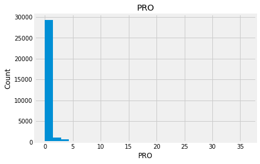

# Explotatory Data Analysis

1. [General info about dataset and its variables](#General-info-about-dataset-and-its-variables)
    * [Reading data](#Read-data-from-.cvs-file)
    * [General information exploration](#General-information-exploration)
    * [Continuous variables](#Continuous-variables-exploration )
    * [Categorical variables](#Categorical-variables)
2. [Bivariate analysis](#Bivariate-analysis)
    * [Continuous variables](#Relationship-between-continuous-variables)
    * [Categorical variables](#Relationship-between-categorical-variables)
3. [Other plots from data](#Plots)
4. [Conclusion](#Conclusion)

In this article I would like to take a look at the data we have in the dutch primary school dataset. I want to investigate what variables I have, do I have some outliers or not and also is there any relationship between features.

## General info about dataset and its variables

### Read the data from a .cvs file


```python
import pandas as pd 
import numpy as np 
import matplotlib.pyplot as plt
import seaborn as sns
plt.style.use('fivethirtyeight')
import warnings
warnings.filterwarnings('ignore')
%matplotlib inline

data = pd.read_csv("./make_school_data/main/output/Score.csv", error_bad_lines=False, sep=',', encoding = "ISO-8859-1") 
```

### General information exploration


```python
print(data.shape)
print(data.columns)
data.head()
```

    (31300, 33)
    Index(['SCHOOL_ID', 'DATUM', 'INSTELLINGSNAAM_VESTIGING', 'POSTCODE_VESTIGING',
           'PLAATSNAAM', 'GEMEENTENAAM', 'PROVINCIE', 'SOORT_PO',
           'DENOMINATIE_VESTIGING', 'EXAMEN', 'EXAMEN_AANTAL', 'EXAMEN_GEM',
           'REKENEN_LAGER1F', 'REKENEN_1F', 'REKENEN_1S', 'REKENEN_2F',
           'LV_LAGER1F', 'LV_1F', 'LV_2F', 'TV_LAGER1F', 'TV_1F', 'TV_2F', 'VSO',
           'PRO', 'VMBO', 'VMBO_HAVO', 'HAVO', 'HAVO_VWO', 'VWO',
           'ADVIES_NIET_MOGELIJK', 'TOTAAL_ADVIES', 'LJ8', 'ZIT'],
          dtype='object')


<div>
<style scoped>
    .dataframe tbody tr th:only-of-type {
        vertical-align: middle;
    }

    .dataframe tbody tr th {
        vertical-align: top;
    }

    .dataframe thead th {
        text-align: right;
    }
</style>
<table border="1" class="dataframe">
  <thead>
    <tr style="text-align: right;">
      <th></th>
      <th>SCHOOL_ID</th>
      <th>DATUM</th>
      <th>INSTELLINGSNAAM_VESTIGING</th>
      <th>POSTCODE_VESTIGING</th>
      <th>PLAATSNAAM</th>
      <th>GEMEENTENAAM</th>
      <th>PROVINCIE</th>
      <th>SOORT_PO</th>
      <th>DENOMINATIE_VESTIGING</th>
      <th>EXAMEN</th>
      <th>...</th>
      <th>PRO</th>
      <th>VMBO</th>
      <th>VMBO_HAVO</th>
      <th>HAVO</th>
      <th>HAVO_VWO</th>
      <th>VWO</th>
      <th>ADVIES_NIET_MOGELIJK</th>
      <th>TOTAAL_ADVIES</th>
      <th>LJ8</th>
      <th>ZIT</th>
    </tr>
  </thead>
  <tbody>
    <tr>
      <th>0</th>
      <td>000AP_2015</td>
      <td>2015</td>
      <td>De Schanskorf</td>
      <td>2715BT</td>
      <td>ZOETERMEER</td>
      <td>Zoetermeer</td>
      <td>Zuid-Holland</td>
      <td>Bo</td>
      <td>Gereformeerd vrijgemaakt</td>
      <td>CET</td>
      <td>...</td>
      <td>0</td>
      <td>1</td>
      <td>0</td>
      <td>5</td>
      <td>1</td>
      <td>1</td>
      <td>0</td>
      <td>11</td>
      <td>13</td>
      <td>0</td>
    </tr>
    <tr>
      <th>1</th>
      <td>000AR_2015</td>
      <td>2015</td>
      <td>BS "De Maasparel"</td>
      <td>6109AM</td>
      <td>OHE EN LAAK</td>
      <td>Maasgouw</td>
      <td>Limburg</td>
      <td>Bo</td>
      <td>Rooms-Katholiek</td>
      <td>CET</td>
      <td>...</td>
      <td>0</td>
      <td>1</td>
      <td>0</td>
      <td>7</td>
      <td>0</td>
      <td>6</td>
      <td>0</td>
      <td>18</td>
      <td>17</td>
      <td>0</td>
    </tr>
    <tr>
      <th>2</th>
      <td>000AZ_2015</td>
      <td>2015</td>
      <td>De Kiezel en de Kei</td>
      <td>2971AR</td>
      <td>BLESKENSGRAAF CA</td>
      <td>Molenwaard</td>
      <td>Zuid-Holland</td>
      <td>Bo</td>
      <td>Openbaar</td>
      <td>CET</td>
      <td>...</td>
      <td>1</td>
      <td>3</td>
      <td>5</td>
      <td>3</td>
      <td>2</td>
      <td>4</td>
      <td>0</td>
      <td>22</td>
      <td>19</td>
      <td>3</td>
    </tr>
    <tr>
      <th>3</th>
      <td>000BA_2015</td>
      <td>2015</td>
      <td>OBS De Klimboom</td>
      <td>6666EB</td>
      <td>HETEREN</td>
      <td>Overbetuwe</td>
      <td>Gelderland</td>
      <td>Bo</td>
      <td>Openbaar</td>
      <td>CET</td>
      <td>...</td>
      <td>1</td>
      <td>1</td>
      <td>0</td>
      <td>1</td>
      <td>4</td>
      <td>0</td>
      <td>0</td>
      <td>12</td>
      <td>24</td>
      <td>5</td>
    </tr>
    <tr>
      <th>4</th>
      <td>000BB_2015</td>
      <td>2015</td>
      <td>Obs Letterwies</td>
      <td>9944AR</td>
      <td>NIEUWOLDA</td>
      <td>Oldambt</td>
      <td>Groningen</td>
      <td>Bo</td>
      <td>Openbaar</td>
      <td>CET</td>
      <td>...</td>
      <td>0</td>
      <td>7</td>
      <td>0</td>
      <td>5</td>
      <td>0</td>
      <td>2</td>
      <td>0</td>
      <td>16</td>
      <td>15</td>
      <td>2</td>
    </tr>
  </tbody>
</table>
<p>5 rows × 33 columns</p>
</div>


```python
print(data.nunique(axis=0))
data.describe().apply(lambda s: s.apply(lambda x: format(x, 'f')))
```

    SCHOOL_ID                    31300
    DATUM                            5
    INSTELLINGSNAAM_VESTIGING     6287
    POSTCODE_VESTIGING            6499
    PLAATSNAAM                    1844
    GEMEENTENAAM                   413
    PROVINCIE                       12
    SOORT_PO                         2
    DENOMINATIE_VESTIGING           17
    EXAMEN                           7
    EXAMEN_AANTAL                  132
    EXAMEN_GEM                   14244
    REKENEN_LAGER1F                 31
    REKENEN_1F                      68
    REKENEN_1S                      88
    REKENEN_2F                      59
    LV_LAGER1F                      18
    LV_1F                           50
    LV_2F                          113
    TV_LAGER1F                      31
    TV_1F                           66
    TV_2F                           98
    VSO                             16
    PRO                             32
    VMBO                            48
    VMBO_HAVO                       26
    HAVO                            45
    HAVO_VWO                        31
    VWO                             63
    ADVIES_NIET_MOGELIJK            35
    TOTAAL_ADVIES                  144
    LJ8                            134
    ZIT                             29
    dtype: int64


<div>
<style scoped>
    .dataframe tbody tr th:only-of-type {
        vertical-align: middle;
    }

    .dataframe tbody tr th {
        vertical-align: top;
    }

    .dataframe thead th {
        text-align: right;
    }
</style>
<table border="1" class="dataframe">
  <thead>
    <tr style="text-align: right;">
      <th></th>
      <th>DATUM</th>
      <th>EXAMEN_AANTAL</th>
      <th>EXAMEN_GEM</th>
      <th>REKENEN_LAGER1F</th>
      <th>REKENEN_1F</th>
      <th>REKENEN_1S</th>
      <th>REKENEN_2F</th>
      <th>LV_LAGER1F</th>
      <th>LV_1F</th>
      <th>LV_2F</th>
      <th>...</th>
      <th>PRO</th>
      <th>VMBO</th>
      <th>VMBO_HAVO</th>
      <th>HAVO</th>
      <th>HAVO_VWO</th>
      <th>VWO</th>
      <th>ADVIES_NIET_MOGELIJK</th>
      <th>TOTAAL_ADVIES</th>
      <th>LJ8</th>
      <th>ZIT</th>
    </tr>
  </thead>
  <tbody>
    <tr>
      <th>count</th>
      <td>31300.000000</td>
      <td>31300.000000</td>
      <td>31300.000000</td>
      <td>31300.000000</td>
      <td>31300.000000</td>
      <td>31300.000000</td>
      <td>31300.000000</td>
      <td>31300.000000</td>
      <td>31300.000000</td>
      <td>31300.000000</td>
      <td>...</td>
      <td>31300.000000</td>
      <td>31300.000000</td>
      <td>31300.000000</td>
      <td>31300.000000</td>
      <td>31300.000000</td>
      <td>31300.000000</td>
      <td>31300.000000</td>
      <td>31300.000000</td>
      <td>31300.000000</td>
      <td>31300.000000</td>
    </tr>
    <tr>
      <th>mean</th>
      <td>2017.018818</td>
      <td>27.589904</td>
      <td>399.593409</td>
      <td>1.896741</td>
      <td>9.936709</td>
      <td>8.896326</td>
      <td>1.374026</td>
      <td>0.465304</td>
      <td>5.412875</td>
      <td>16.225623</td>
      <td>...</td>
      <td>0.395719</td>
      <td>5.645911</td>
      <td>2.177348</td>
      <td>5.458562</td>
      <td>2.478594</td>
      <td>5.804217</td>
      <td>0.142077</td>
      <td>28.463482</td>
      <td>21.855974</td>
      <td>2.482300</td>
    </tr>
    <tr>
      <th>std</th>
      <td>1.400569</td>
      <td>17.059502</td>
      <td>196.257453</td>
      <td>2.675862</td>
      <td>8.878866</td>
      <td>10.018202</td>
      <td>4.616997</td>
      <td>1.167952</td>
      <td>5.478845</td>
      <td>14.902800</td>
      <td>...</td>
      <td>1.516142</td>
      <td>4.714144</td>
      <td>2.688906</td>
      <td>4.739689</td>
      <td>3.272615</td>
      <td>6.061055</td>
      <td>1.420359</td>
      <td>17.463933</td>
      <td>19.278557</td>
      <td>2.909880</td>
    </tr>
    <tr>
      <th>min</th>
      <td>2015.000000</td>
      <td>5.000000</td>
      <td>50.000000</td>
      <td>0.000000</td>
      <td>0.000000</td>
      <td>0.000000</td>
      <td>0.000000</td>
      <td>0.000000</td>
      <td>0.000000</td>
      <td>0.000000</td>
      <td>...</td>
      <td>0.000000</td>
      <td>0.000000</td>
      <td>0.000000</td>
      <td>0.000000</td>
      <td>0.000000</td>
      <td>0.000000</td>
      <td>0.000000</td>
      <td>0.000000</td>
      <td>0.000000</td>
      <td>0.000000</td>
    </tr>
    <tr>
      <th>25%</th>
      <td>2016.000000</td>
      <td>15.000000</td>
      <td>197.370536</td>
      <td>0.000000</td>
      <td>3.000000</td>
      <td>0.000000</td>
      <td>0.000000</td>
      <td>0.000000</td>
      <td>1.000000</td>
      <td>5.000000</td>
      <td>...</td>
      <td>0.000000</td>
      <td>2.000000</td>
      <td>0.000000</td>
      <td>2.000000</td>
      <td>0.000000</td>
      <td>2.000000</td>
      <td>0.000000</td>
      <td>16.000000</td>
      <td>6.000000</td>
      <td>0.000000</td>
    </tr>
    <tr>
      <th>50%</th>
      <td>2017.000000</td>
      <td>24.000000</td>
      <td>532.818182</td>
      <td>1.000000</td>
      <td>9.000000</td>
      <td>6.000000</td>
      <td>0.000000</td>
      <td>0.000000</td>
      <td>4.000000</td>
      <td>14.000000</td>
      <td>...</td>
      <td>0.000000</td>
      <td>5.000000</td>
      <td>1.000000</td>
      <td>4.000000</td>
      <td>1.000000</td>
      <td>4.000000</td>
      <td>0.000000</td>
      <td>25.000000</td>
      <td>20.000000</td>
      <td>2.000000</td>
    </tr>
    <tr>
      <th>75%</th>
      <td>2018.000000</td>
      <td>35.000000</td>
      <td>536.545455</td>
      <td>3.000000</td>
      <td>15.000000</td>
      <td>13.000000</td>
      <td>0.000000</td>
      <td>0.000000</td>
      <td>8.000000</td>
      <td>24.000000</td>
      <td>...</td>
      <td>0.000000</td>
      <td>8.000000</td>
      <td>3.000000</td>
      <td>8.000000</td>
      <td>4.000000</td>
      <td>8.000000</td>
      <td>0.000000</td>
      <td>37.000000</td>
      <td>31.000000</td>
      <td>4.000000</td>
    </tr>
    <tr>
      <th>max</th>
      <td>2019.000000</td>
      <td>163.000000</td>
      <td>758.533333</td>
      <td>35.000000</td>
      <td>82.000000</td>
      <td>106.000000</td>
      <td>63.000000</td>
      <td>20.000000</td>
      <td>54.000000</td>
      <td>125.000000</td>
      <td>...</td>
      <td>36.000000</td>
      <td>51.000000</td>
      <td>28.000000</td>
      <td>67.000000</td>
      <td>35.000000</td>
      <td>109.000000</td>
      <td>102.000000</td>
      <td>227.000000</td>
      <td>161.000000</td>
      <td>53.000000</td>
    </tr>
  </tbody>
</table>
<p>8 rows × 24 columns</p>
</div>


We have 31300 observations and 33 variables. From the last table with descriptive statistics we can see that some of the columns (like **EXAMEN_AANTAL**, **REKENEN_LAGER1F**, **REKENEN_1F**, **REKENEN_1S**, etc.) has max value much bigger than its mean, standart deviation or min value. It could mean that this variables have outliers or they don't follow normal distribution. Let's analyse them first.


### Continuous variables exploration 


```python
numeric_data = data.select_dtypes(include=[np.number])
print(numeric_data.columns)
numeric_data.head()
```

    Index(['DATUM', 'EXAMEN_AANTAL', 'EXAMEN_GEM', 'REKENEN_LAGER1F', 'REKENEN_1F',
           'REKENEN_1S', 'REKENEN_2F', 'LV_LAGER1F', 'LV_1F', 'LV_2F',
           'TV_LAGER1F', 'TV_1F', 'TV_2F', 'VSO', 'PRO', 'VMBO', 'VMBO_HAVO',
           'HAVO', 'HAVO_VWO', 'VWO', 'ADVIES_NIET_MOGELIJK', 'TOTAAL_ADVIES',
           'LJ8', 'ZIT'],
          dtype='object')


<div>
<style scoped>
    .dataframe tbody tr th:only-of-type {
        vertical-align: middle;
    }

    .dataframe tbody tr th {
        vertical-align: top;
    }

    .dataframe thead th {
        text-align: right;
    }
</style>
<table border="1" class="dataframe">
  <thead>
    <tr style="text-align: right;">
      <th></th>
      <th>DATUM</th>
      <th>EXAMEN_AANTAL</th>
      <th>EXAMEN_GEM</th>
      <th>REKENEN_LAGER1F</th>
      <th>REKENEN_1F</th>
      <th>REKENEN_1S</th>
      <th>REKENEN_2F</th>
      <th>LV_LAGER1F</th>
      <th>LV_1F</th>
      <th>LV_2F</th>
      <th>...</th>
      <th>PRO</th>
      <th>VMBO</th>
      <th>VMBO_HAVO</th>
      <th>HAVO</th>
      <th>HAVO_VWO</th>
      <th>VWO</th>
      <th>ADVIES_NIET_MOGELIJK</th>
      <th>TOTAAL_ADVIES</th>
      <th>LJ8</th>
      <th>ZIT</th>
    </tr>
  </thead>
  <tbody>
    <tr>
      <th>0</th>
      <td>2015</td>
      <td>11</td>
      <td>534.3</td>
      <td>0</td>
      <td>0</td>
      <td>0</td>
      <td>0</td>
      <td>0</td>
      <td>0</td>
      <td>0</td>
      <td>...</td>
      <td>0</td>
      <td>1</td>
      <td>0</td>
      <td>5</td>
      <td>1</td>
      <td>1</td>
      <td>0</td>
      <td>11</td>
      <td>13</td>
      <td>0</td>
    </tr>
    <tr>
      <th>1</th>
      <td>2015</td>
      <td>18</td>
      <td>539.8</td>
      <td>0</td>
      <td>0</td>
      <td>0</td>
      <td>0</td>
      <td>0</td>
      <td>0</td>
      <td>0</td>
      <td>...</td>
      <td>0</td>
      <td>1</td>
      <td>0</td>
      <td>7</td>
      <td>0</td>
      <td>6</td>
      <td>0</td>
      <td>18</td>
      <td>17</td>
      <td>0</td>
    </tr>
    <tr>
      <th>2</th>
      <td>2015</td>
      <td>22</td>
      <td>532.9</td>
      <td>0</td>
      <td>0</td>
      <td>0</td>
      <td>0</td>
      <td>0</td>
      <td>0</td>
      <td>0</td>
      <td>...</td>
      <td>1</td>
      <td>3</td>
      <td>5</td>
      <td>3</td>
      <td>2</td>
      <td>4</td>
      <td>0</td>
      <td>22</td>
      <td>19</td>
      <td>3</td>
    </tr>
    <tr>
      <th>3</th>
      <td>2015</td>
      <td>11</td>
      <td>536.2</td>
      <td>0</td>
      <td>0</td>
      <td>0</td>
      <td>0</td>
      <td>0</td>
      <td>0</td>
      <td>0</td>
      <td>...</td>
      <td>1</td>
      <td>1</td>
      <td>0</td>
      <td>1</td>
      <td>4</td>
      <td>0</td>
      <td>0</td>
      <td>12</td>
      <td>24</td>
      <td>5</td>
    </tr>
    <tr>
      <th>4</th>
      <td>2015</td>
      <td>16</td>
      <td>531.3</td>
      <td>0</td>
      <td>0</td>
      <td>0</td>
      <td>0</td>
      <td>0</td>
      <td>0</td>
      <td>0</td>
      <td>...</td>
      <td>0</td>
      <td>7</td>
      <td>0</td>
      <td>5</td>
      <td>0</td>
      <td>2</td>
      <td>0</td>
      <td>16</td>
      <td>15</td>
      <td>2</td>
    </tr>
  </tbody>
</table>
<p>5 rows × 24 columns</p>
</div>


We can see that **DATUM** is actually a categorical variable, so we need to remove it from ***numeric_data***. But everything else is continuous, so let's take a look at its distribution:


```python
numeric_data.drop('DATUM', 1, inplace = True)
print(numeric_data.columns)
```

    Index(['EXAMEN_AANTAL', 'EXAMEN_GEM', 'REKENEN_LAGER1F', 'REKENEN_1F',
           'REKENEN_1S', 'REKENEN_2F', 'LV_LAGER1F', 'LV_1F', 'LV_2F',
           'TV_LAGER1F', 'TV_1F', 'TV_2F', 'VSO', 'PRO', 'VMBO', 'VMBO_HAVO',
           'HAVO', 'HAVO_VWO', 'VWO', 'ADVIES_NIET_MOGELIJK', 'TOTAAL_ADVIES',
           'LJ8', 'ZIT'],
          dtype='object')


```python
for feature in numeric_data:
    new_data=numeric_data.copy()
    new_data[feature].hist(bins=25)
    plt.xlabel(feature)
    plt.ylabel("Count")
    plt.title(feature)
    plt.show()
```


    

    


    

    


    

    


    

    


    

    


    

    


    

    


    

    


    

    


    

    


    

    


    

    


    

    


    

    


    

    


    

    


    

    


    

    


    

    


    

    


    

    


    

    


    

    


Indead we can see that almost none of the variables looks like a normally distributed variable. I think it can be so because this dataset is a mix of data for different final exams and different school educational systems. If we would select some specific data (e.g. an exam score for only one type of exam for a specific year) we get a more normalized data.
Let's go to categorical variables and see what we have there.

### Categorical variables


```python
categorical_data = data.drop(numeric_data, axis=1)
categorical_data = categorical_data.drop('SCHOOL_ID', 1)
print(categorical_data.shape)
categorical_data.head()
```

    (31300, 9)


<div>
<style scoped>
    .dataframe tbody tr th:only-of-type {
        vertical-align: middle;
    }

    .dataframe tbody tr th {
        vertical-align: top;
    }

    .dataframe thead th {
        text-align: right;
    }
</style>
<table border="1" class="dataframe">
  <thead>
    <tr style="text-align: right;">
      <th></th>
      <th>DATUM</th>
      <th>INSTELLINGSNAAM_VESTIGING</th>
      <th>POSTCODE_VESTIGING</th>
      <th>PLAATSNAAM</th>
      <th>GEMEENTENAAM</th>
      <th>PROVINCIE</th>
      <th>SOORT_PO</th>
      <th>DENOMINATIE_VESTIGING</th>
      <th>EXAMEN</th>
    </tr>
  </thead>
  <tbody>
    <tr>
      <th>0</th>
      <td>2015</td>
      <td>De Schanskorf</td>
      <td>2715BT</td>
      <td>ZOETERMEER</td>
      <td>Zoetermeer</td>
      <td>Zuid-Holland</td>
      <td>Bo</td>
      <td>Gereformeerd vrijgemaakt</td>
      <td>CET</td>
    </tr>
    <tr>
      <th>1</th>
      <td>2015</td>
      <td>BS "De Maasparel"</td>
      <td>6109AM</td>
      <td>OHE EN LAAK</td>
      <td>Maasgouw</td>
      <td>Limburg</td>
      <td>Bo</td>
      <td>Rooms-Katholiek</td>
      <td>CET</td>
    </tr>
    <tr>
      <th>2</th>
      <td>2015</td>
      <td>De Kiezel en de Kei</td>
      <td>2971AR</td>
      <td>BLESKENSGRAAF CA</td>
      <td>Molenwaard</td>
      <td>Zuid-Holland</td>
      <td>Bo</td>
      <td>Openbaar</td>
      <td>CET</td>
    </tr>
    <tr>
      <th>3</th>
      <td>2015</td>
      <td>OBS De Klimboom</td>
      <td>6666EB</td>
      <td>HETEREN</td>
      <td>Overbetuwe</td>
      <td>Gelderland</td>
      <td>Bo</td>
      <td>Openbaar</td>
      <td>CET</td>
    </tr>
    <tr>
      <th>4</th>
      <td>2015</td>
      <td>Obs Letterwies</td>
      <td>9944AR</td>
      <td>NIEUWOLDA</td>
      <td>Oldambt</td>
      <td>Groningen</td>
      <td>Bo</td>
      <td>Openbaar</td>
      <td>CET</td>
    </tr>
  </tbody>
</table>
</div>


```python
plt.figure(figsize=(5, 5))
ax = sns.countplot(y='DATUM',data=categorical_data, order = data['DATUM'].value_counts().index)
ax.set_title('Amount of schools per year')
```


    Text(0.5, 1.0, 'Amount of schools per year')


    

    


Let's take a look at the plots of the variables with relatively small amount of unique values. I will show a plot for variables like **EXAMEN** or **GEMEENTENAAM**. I won't show plots for variables like **INSTELLINGSNAAM_VESTIGING** because we already know it has 6287 of unique values.


```python
plt.figure(figsize=(8, 8))
ax = sns.countplot(y='PROVINCIE',data=categorical_data, order = data['PROVINCIE'].value_counts().index)
ax.set_title('Amount of schools per province')
```


    Text(0.5, 1.0, 'Amount of schools per province')


    

    


```python
plt.figure(figsize=(8,8))
ax = sns.countplot(x='GEMEENTENAAM',data=categorical_data, order = data['GEMEENTENAAM'].value_counts().index)
ax.set_title('Amount of schools per GEMEENTE')
```


    Text(0.5, 1.0, 'Amount of schools per GEMEENTE')


    

    


```python
plt.figure(figsize=(3, 3))
ax = sns.countplot(x='SOORT_PO', data=categorical_data, order = data['SOORT_PO'].value_counts().index)
ax.set_title('Amount of schools per type')
```


    Text(0.5, 1.0, 'Amount of schools per type')


    

    


```python
plt.figure(figsize=(8, 8))
ax = sns.countplot(y='DENOMINATIE_VESTIGING',data=categorical_data, order = data['DENOMINATIE_VESTIGING'].value_counts().index)
ax.set_title('Amount of schools per denomination')
```


    Text(0.5, 1.0, 'Amount of schools per denomination')


    

    


The last plot above shows us that there are several values of the **DENOMINATIE_VESTIGING** column with a relatively small amounts of observation. Probably these values won't be statistically significant in the entire dataset.


```python
plt.figure(figsize=(5, 5))
ax = sns.countplot(y='EXAMEN',data=categorical_data, order = data['EXAMEN'].value_counts().index)
ax.set_title('Amount of schools per chosen exams')
```


    Text(0.5, 1.0, 'Amount of schools per chosen exams')


    

    


## Bivariate analysis

In this part I'm going to see is there any relashionship between variables.

### Relationship between continuous variables

To analyse relashionships between continuous variables I will build a correlation matrix and then take a look at the scatterplots of the most correlated variables:


```python
corr_matrix = numeric_data.corr()
f, ax = plt.subplots(figsize = (14,12))
plt.title('Correlation of numeric factors', y = 1, size = 16)
sns.heatmap(corr_matrix, vmax = .8, annot_kws={'size': 8}, annot = True, square=True)
```


    <AxesSubplot:title={'center':'Correlation of numeric factors'}>


    

    


The correlation matrix shows us that there are not a lot of variables correlated with each other. Most of the variables which have a correlation between each other are about number of students who know math or language on different levels and numbers of school advices for high education (HAVO_VWO and VWO). Let's take a look at the paired scatterplots of the most correlated variables


```python
numeric_data.columns
```


    Index(['EXAMEN_AANTAL', 'EXAMEN_GEM', 'REKENEN_LAGER1F', 'REKENEN_1F',
           'REKENEN_1S', 'REKENEN_2F', 'LV_LAGER1F', 'LV_1F', 'LV_2F',
           'TV_LAGER1F', 'TV_1F', 'TV_2F', 'VSO', 'PRO', 'VMBO', 'VMBO_HAVO',
           'HAVO', 'HAVO_VWO', 'VWO', 'ADVIES_NIET_MOGELIJK', 'TOTAAL_ADVIES',
           'LJ8', 'ZIT'],
          dtype='object')


```python
columns = ['REKENEN_LAGER1F', 'REKENEN_1F', 'REKENEN_1S', 'REKENEN_2F', 'LV_LAGER1F', 'LV_1F', 'LV_2F',
           'TV_LAGER1F', 'TV_1F', 'TV_2F', 'HAVO_VWO', 'VWO']
corr_data = numeric_data[columns]
corr_data.head()
```


<div>
<style scoped>
    .dataframe tbody tr th:only-of-type {
        vertical-align: middle;
    }

    .dataframe tbody tr th {
        vertical-align: top;
    }

    .dataframe thead th {
        text-align: right;
    }
</style>
<table border="1" class="dataframe">
  <thead>
    <tr style="text-align: right;">
      <th></th>
      <th>REKENEN_LAGER1F</th>
      <th>REKENEN_1F</th>
      <th>REKENEN_1S</th>
      <th>REKENEN_2F</th>
      <th>LV_LAGER1F</th>
      <th>LV_1F</th>
      <th>LV_2F</th>
      <th>TV_LAGER1F</th>
      <th>TV_1F</th>
      <th>TV_2F</th>
      <th>HAVO_VWO</th>
      <th>VWO</th>
    </tr>
  </thead>
  <tbody>
    <tr>
      <th>0</th>
      <td>0</td>
      <td>0</td>
      <td>0</td>
      <td>0</td>
      <td>0</td>
      <td>0</td>
      <td>0</td>
      <td>0</td>
      <td>0</td>
      <td>0</td>
      <td>1</td>
      <td>1</td>
    </tr>
    <tr>
      <th>1</th>
      <td>0</td>
      <td>0</td>
      <td>0</td>
      <td>0</td>
      <td>0</td>
      <td>0</td>
      <td>0</td>
      <td>0</td>
      <td>0</td>
      <td>0</td>
      <td>0</td>
      <td>6</td>
    </tr>
    <tr>
      <th>2</th>
      <td>0</td>
      <td>0</td>
      <td>0</td>
      <td>0</td>
      <td>0</td>
      <td>0</td>
      <td>0</td>
      <td>0</td>
      <td>0</td>
      <td>0</td>
      <td>2</td>
      <td>4</td>
    </tr>
    <tr>
      <th>3</th>
      <td>0</td>
      <td>0</td>
      <td>0</td>
      <td>0</td>
      <td>0</td>
      <td>0</td>
      <td>0</td>
      <td>0</td>
      <td>0</td>
      <td>0</td>
      <td>4</td>
      <td>0</td>
    </tr>
    <tr>
      <th>4</th>
      <td>0</td>
      <td>0</td>
      <td>0</td>
      <td>0</td>
      <td>0</td>
      <td>0</td>
      <td>0</td>
      <td>0</td>
      <td>0</td>
      <td>0</td>
      <td>0</td>
      <td>2</td>
    </tr>
  </tbody>
</table>
</div>


```python
sns.pairplot(corr_data)
```


    <seaborn.axisgrid.PairGrid at 0x12125c7c0>


    

    


I would assume that if in a particular school students don't know math well, they should know languages better. But looking at the plots above I see some correlation between numbers of students who don't have good knowledge in either subject. It's probably not enough to deny my assumption, though it just shows the level of education that students receive in the school.


### Relationship between categorical variables

We can find the relashionship between categorical variables using 2 ways:
- Encode categorical variables to numeric ones and then use a correlation matrix
- Calculate Cramer's V statistic. 

Let's use the first one to see if there is any relationship between categorical variables:


```python
from sklearn.preprocessing import LabelEncoder

for column in categorical_data.columns:
    categorical_data[column] = LabelEncoder().fit_transform(categorical_data[column])
print(categorical_data.columns)
categorical_data.head()
```

    Index(['DATUM', 'INSTELLINGSNAAM_VESTIGING', 'POSTCODE_VESTIGING',
           'PLAATSNAAM', 'GEMEENTENAAM', 'PROVINCIE', 'SOORT_PO',
           'DENOMINATIE_VESTIGING', 'EXAMEN'],
          dtype='object')


<div>
<style scoped>
    .dataframe tbody tr th:only-of-type {
        vertical-align: middle;
    }

    .dataframe tbody tr th {
        vertical-align: top;
    }

    .dataframe thead th {
        text-align: right;
    }
</style>
<table border="1" class="dataframe">
  <thead>
    <tr style="text-align: right;">
      <th></th>
      <th>DATUM</th>
      <th>INSTELLINGSNAAM_VESTIGING</th>
      <th>POSTCODE_VESTIGING</th>
      <th>PLAATSNAAM</th>
      <th>GEMEENTENAAM</th>
      <th>PROVINCIE</th>
      <th>SOORT_PO</th>
      <th>DENOMINATIE_VESTIGING</th>
      <th>EXAMEN</th>
    </tr>
  </thead>
  <tbody>
    <tr>
      <th>0</th>
      <td>0</td>
      <td>2553</td>
      <td>1401</td>
      <td>1809</td>
      <td>403</td>
      <td>11</td>
      <td>0</td>
      <td>4</td>
      <td>2</td>
    </tr>
    <tr>
      <th>1</th>
      <td>0</td>
      <td>147</td>
      <td>4026</td>
      <td>1134</td>
      <td>210</td>
      <td>5</td>
      <td>0</td>
      <td>12</td>
      <td>2</td>
    </tr>
    <tr>
      <th>2</th>
      <td>0</td>
      <td>2335</td>
      <td>1565</td>
      <td>196</td>
      <td>227</td>
      <td>11</td>
      <td>0</td>
      <td>9</td>
      <td>2</td>
    </tr>
    <tr>
      <th>3</th>
      <td>0</td>
      <td>3993</td>
      <td>4354</td>
      <td>670</td>
      <td>271</td>
      <td>3</td>
      <td>0</td>
      <td>9</td>
      <td>2</td>
    </tr>
    <tr>
      <th>4</th>
      <td>0</td>
      <td>4496</td>
      <td>6459</td>
      <td>1081</td>
      <td>253</td>
      <td>4</td>
      <td>0</td>
      <td>9</td>
      <td>2</td>
    </tr>
  </tbody>
</table>
</div>


```python
corr_categorical_matrix = categorical_data.corr()
f, ax = plt.subplots(figsize = (14,12))
plt.title('Correlation of numeric factors', y = 1, size = 16)
sns.heatmap(corr_categorical_matrix, vmax = .8, annot_kws={'size': 8}, annot = True, square=True)
```


    <AxesSubplot:title={'center':'Correlation of numeric factors'}>


    

    


We can see almost no correlation between variables. Only between **PLAATSNAAM** and **GEMEENTENAAM** there is some, and also between **POSTCODE_VESTIGING** and **PROVINCIE**. However it was expected because these variables represent actually the same info in different forms - a place where the school is located.

## Plots


To get some insights from the data let's add some new variables:


```python
data["GOOD_MATH"] = data['REKENEN_1F'] + data['REKENEN_1S'] + data['REKENEN_2F']
data["GOOD_LANGUAGE"] = data['LV_1F'] + data['LV_2F'] + data['TV_1F'] + data['TV_2F']
data["HIGH_EDUCATION"] = data['HAVO'] + data['HAVO_VWO'] + data['VWO']
data["ZIT_PER"] = data['ZIT']/data['LJ8']
data.head()
```


<div>
<style scoped>
    .dataframe tbody tr th:only-of-type {
        vertical-align: middle;
    }

    .dataframe tbody tr th {
        vertical-align: top;
    }

    .dataframe thead th {
        text-align: right;
    }
</style>
<table border="1" class="dataframe">
  <thead>
    <tr style="text-align: right;">
      <th></th>
      <th>SCHOOL_ID</th>
      <th>DATUM</th>
      <th>INSTELLINGSNAAM_VESTIGING</th>
      <th>POSTCODE_VESTIGING</th>
      <th>PLAATSNAAM</th>
      <th>GEMEENTENAAM</th>
      <th>PROVINCIE</th>
      <th>SOORT_PO</th>
      <th>DENOMINATIE_VESTIGING</th>
      <th>EXAMEN</th>
      <th>...</th>
      <th>HAVO_VWO</th>
      <th>VWO</th>
      <th>ADVIES_NIET_MOGELIJK</th>
      <th>TOTAAL_ADVIES</th>
      <th>LJ8</th>
      <th>ZIT</th>
      <th>GOOD_MATH</th>
      <th>GOOD_LANGUAGE</th>
      <th>HIGH_EDUCATION</th>
      <th>ZIT_PER</th>
    </tr>
  </thead>
  <tbody>
    <tr>
      <th>0</th>
      <td>000AP_2015</td>
      <td>2015</td>
      <td>De Schanskorf</td>
      <td>2715BT</td>
      <td>ZOETERMEER</td>
      <td>Zoetermeer</td>
      <td>Zuid-Holland</td>
      <td>Bo</td>
      <td>Gereformeerd vrijgemaakt</td>
      <td>CET</td>
      <td>...</td>
      <td>1</td>
      <td>1</td>
      <td>0</td>
      <td>11</td>
      <td>13</td>
      <td>0</td>
      <td>0</td>
      <td>0</td>
      <td>7</td>
      <td>0.000000</td>
    </tr>
    <tr>
      <th>1</th>
      <td>000AR_2015</td>
      <td>2015</td>
      <td>BS "De Maasparel"</td>
      <td>6109AM</td>
      <td>OHE EN LAAK</td>
      <td>Maasgouw</td>
      <td>Limburg</td>
      <td>Bo</td>
      <td>Rooms-Katholiek</td>
      <td>CET</td>
      <td>...</td>
      <td>0</td>
      <td>6</td>
      <td>0</td>
      <td>18</td>
      <td>17</td>
      <td>0</td>
      <td>0</td>
      <td>0</td>
      <td>13</td>
      <td>0.000000</td>
    </tr>
    <tr>
      <th>2</th>
      <td>000AZ_2015</td>
      <td>2015</td>
      <td>De Kiezel en de Kei</td>
      <td>2971AR</td>
      <td>BLESKENSGRAAF CA</td>
      <td>Molenwaard</td>
      <td>Zuid-Holland</td>
      <td>Bo</td>
      <td>Openbaar</td>
      <td>CET</td>
      <td>...</td>
      <td>2</td>
      <td>4</td>
      <td>0</td>
      <td>22</td>
      <td>19</td>
      <td>3</td>
      <td>0</td>
      <td>0</td>
      <td>9</td>
      <td>0.157895</td>
    </tr>
    <tr>
      <th>3</th>
      <td>000BA_2015</td>
      <td>2015</td>
      <td>OBS De Klimboom</td>
      <td>6666EB</td>
      <td>HETEREN</td>
      <td>Overbetuwe</td>
      <td>Gelderland</td>
      <td>Bo</td>
      <td>Openbaar</td>
      <td>CET</td>
      <td>...</td>
      <td>4</td>
      <td>0</td>
      <td>0</td>
      <td>12</td>
      <td>24</td>
      <td>5</td>
      <td>0</td>
      <td>0</td>
      <td>5</td>
      <td>0.208333</td>
    </tr>
    <tr>
      <th>4</th>
      <td>000BB_2015</td>
      <td>2015</td>
      <td>Obs Letterwies</td>
      <td>9944AR</td>
      <td>NIEUWOLDA</td>
      <td>Oldambt</td>
      <td>Groningen</td>
      <td>Bo</td>
      <td>Openbaar</td>
      <td>CET</td>
      <td>...</td>
      <td>0</td>
      <td>2</td>
      <td>0</td>
      <td>16</td>
      <td>15</td>
      <td>2</td>
      <td>0</td>
      <td>0</td>
      <td>7</td>
      <td>0.133333</td>
    </tr>
  </tbody>
</table>
<p>5 rows × 37 columns</p>
</div>


Let's see some plots for these new variables:


```python
columns = ['GOOD_MATH', 'GOOD_LANGUAGE', 'HIGH_EDUCATION', 'ZIT_PER', 'PROVINCIE']
new_data = data[columns]
sns.pairplot(new_data, hue = 'PROVINCIE')
```


    <seaborn.axisgrid.PairGrid at 0x11f298850>


    

    


Plots above show us that there is probably a negative relashionship between the amount of students who stay in a primary school longer and a quality of knowledge. We can also see a strong positive correlation between a good knowledge of math&language and school's recommendation for a higher education.
As we see this strong positive correlation, we don't really need to explore all 3 columns ('GOOD_MATH', 'GOOD_LANGUAGE' and 'HIGH_EDUCATION'), instead we can look at the plots for only one of them in relation to other interesting variables:


```python
categorical_features = ['PROVINCIE', 'DENOMINATIE_VESTIGING', 'EXAMEN', 'DATUM']
for column in categorical_features:
    data[column] = data[column].astype('category')
    if data[column].isnull().any():
        data[column] = data[column].cat.add_categories(['MISSING'])
        data[column] = data[column].fillna('MISSING')
        
def boxplot(x, y, **kwargs):
    sns.boxplot(x=x, y=y)
    x=plt.xticks(rotation=90)

f = pd.melt(data, id_vars=['HIGH_EDUCATION'], value_vars=categorical_features)
g = sns.FacetGrid(f, col="variable",  col_wrap=2, sharex=False, sharey=False, size=5)
g = g.map(boxplot, "value", "HIGH_EDUCATION")
```


    

    


```python
f = pd.melt(data, id_vars=['ZIT_PER'], value_vars=categorical_features)
g = sns.FacetGrid(f, col="variable",  col_wrap=2, sharex=False, sharey=False, size=5)
g = g.map(boxplot, "value", "ZIT_PER")
```


    

    


And finally let's take a look at some plots for the CET exam:


```python
data_CET = data[data['EXAMEN'] == "CET"]
```


```python
f, ax = plt.subplots(figsize=(8, 8))
fig = sns.boxplot(x='EXAMEN_GEM', y="PROVINCIE", data=data_CET)
```


    

    


```python
f, ax = plt.subplots(figsize=(8, 8))
fig = sns.boxplot(x='EXAMEN_GEM', y="DENOMINATIE_VESTIGING", data=data_CET)
```


    

    


```python
sns.relplot("HIGH_EDUCATION", "EXAMEN_GEM", data=data_CET)
```


    <seaborn.axisgrid.FacetGrid at 0x108882550>


    

    


We can see on the plot above that the higher the CET score is, the bigger amount of students gets an advice for a high education.

## Conclusion

As a result of this data analysis I can say that we now have data about schools in The Netherlands for years 2015-2018. It contains mostly info about schools locations, scores on the final exams, numbers of students on different levels of knowledge and data about schools advices for a secondary education.
After looking at the dataset and plots built out of this data, I can conclude that students who have good knowledge in math and language have bigger chances to get a school advice for a high education. Also we can say from the analysis that a quality of education in a school could be estimated by its average score on the final exam or a number of students who know well both math and language.


```python

```
